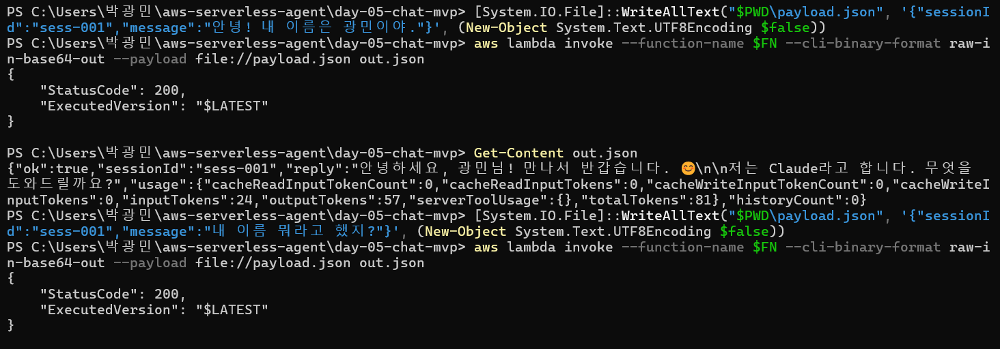
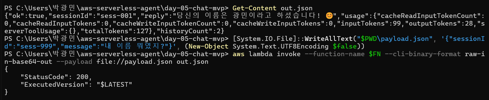
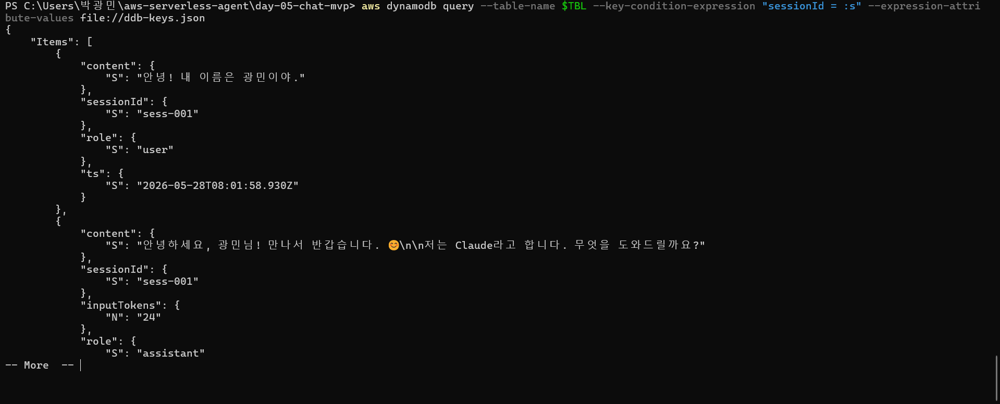

# Day 5: Chat MVP — Lambda + DDB + Bedrock 통합

Phase 2 시작. Day 2~4 에서 따로 다룬 부품들을 하나의 흐름으로 조립.
**= MVP 챗봇의 첫 동작 (HTTP 노출은 아직 X — Day 6에서)**

## 🎯 학습 목표

- 3개 서비스(Lambda + DDB + Bedrock)를 한 핸들러에서 엮기
- DDB Sort Key 로 대화 이력 시간순 관리
- Bedrock 호출에 이력(history)을 context 로 넘기는 방법
- Lambda IAM Role 에 **DDB grant + Bedrock InvokeModel** 두 권한 부여

## 📐 아키텍처

```
                    ┌───────────────────────────┐
                    │     ConversationsTable     │
                    │  PK: sessionId             │
                    │  SK: ts (ISO timestamp)    │
                    └─────────────┬─────────────┘
                          Query / Put │
                                      ▼
User → aws lambda invoke ──→ ChatFunction (Lambda)
                                      │
                                      │ ConverseCommand
                                      ▼
                              AWS Bedrock
                          (Claude Haiku 4.5)
```

호출 1회당 Lambda 가 하는 일:
1. 같은 `sessionId` 이력 Query (최근 20턴)
2. user 메시지 Put
3. `history + user` → Bedrock Converse
4. assistant 응답 Put
5. 응답 반환

## 📝 배운 것

### 1. DDB Sort Key — 시간순 이력 관리의 정석 패턴

Day 4 의 `NotesTable` 은 PK 하나뿐(`id`)이라 한 건씩 GetItem 만 가능. 대화 이력은 "같은 세션의 메시지 N개를 시간순으로" 가져와야 하니 **PK+SK** 가 필요.

```ts
partitionKey: { name: 'sessionId', type: STRING },
sortKey:      { name: 'ts',        type: STRING },
```

→ `Query(sessionId="abc", ScanIndexForward=true)` 한 번이면 "abc 세션의 모든 메시지 시간순"이 그대로 나옴. **Scan 안 쓰고 Query 로 해결** — Day 4 README 에서 예고한 개선 적용.

ISO timestamp 를 SK 로 쓰면 사전순 = 시간순이라 추가 인덱스 없이도 정렬됨. (정밀도 충돌이 걱정되면 `ts#ulid` 같이 합치는 패턴.)

### 2. Bedrock 권한은 `grantInvoke` 같은 게 없음

DDB 는 `table.grantReadWriteData(fn)` 한 줄로 끝이지만, Bedrock 클라이언트는 CDK 에 그런 헬퍼가 없음. IAM statement 직접 부착:

```ts
fn.addToRolePolicy(new iam.PolicyStatement({
  actions: ['bedrock:InvokeModel'],
  resources: ['*'],
}));
```

`resources: ['*']` 는 학습용. 실서비스에선 **foundation-model ARN + inference-profile ARN 두 종류** 다 명시해야 함:

```
arn:aws:bedrock:us-east-1::foundation-model/anthropic.claude-haiku-4-5-*
arn:aws:bedrock:*::inference-profile/global.anthropic.claude-haiku-4-5-*
```

→ Global inference profile 은 여러 리전 모델로 자동 라우팅하므로 두 ARN 다 필요. 한쪽만 허용하면 `AccessDeniedException`.

### 3. Converse API + 이력 누적 패턴

Day 2 에서 단발 호출만 했음. 멀티턴은 `messages` 배열에 과거 대화를 그대로 누적:

```js
const messages = [
  { role: "user",      content: [{ text: "안녕" }] },
  { role: "assistant", content: [{ text: "안녕하세요!" }] },
  { role: "user",      content: [{ text: "오늘 날씨 어때?" }] },  // ← 새 메시지
];
```

DDB Query 결과를 그대로 이 포맷으로 `.map()` 하면 끝. Bedrock 이 context 를 알아서 인식.

**주의: 토큰 비용은 매 호출마다 history 전체에 비례.** 100턴 누적된 세션이면 매 호출 input 토큰이 100배. → `HISTORY_LIMIT=20` 같이 슬라이딩 윈도우로 제한 필요. 환경변수로 빼둠.

### 4. Lambda 환경변수 — 모델 ID 도 분리

```ts
environment: {
  TABLE_NAME: table.tableName,
  MODEL_ID: 'global.anthropic.claude-haiku-4-5-20251001-v1:0',
  HISTORY_LIMIT: '20',
}
```

모델 교체 / 비용 튜닝 시 코드 변경 없이 `cdk deploy` 만으로 끝. Day 4 의 `TABLE_NAME` 패턴을 확장.

### 5. SDK 두 개 동시 사용 — 메모리 256MB 는 빠듯

DDB SDK + Bedrock SDK 둘 다 띄우면 콜드스타트가 길어짐. memory 를 512MB 로 올림. (메모리 늘리면 CPU 도 같이 올라가서 콜드스타트 빨라짐 — Lambda 의 좀 특이한 점)

### 6. Lambda timeout — 30초

Bedrock Converse 호출이 응답에 보통 1~5초, 길면 10초 넘게도 걸림. Day 3/4 의 10초로는 부족. 30초로 두되, 30초 넘는 응답은 streaming 으로 전환 필요 (Phase 3).

## ▶️ 배포 & 테스트

```bash
cd day-05-chat-mvp
npm install
npx cdk bootstrap   # 계정/리전당 1회만 (Day 3에서 이미 했으면 생략)
npx cdk deploy
```

배포 후 출력되는 `FunctionName` 으로 호출:

```bash
# 1턴: 새 세션 시작
aws lambda invoke \
  --function-name <FunctionName> \
  --cli-binary-format raw-in-base64-out \
  --payload '{"sessionId":"sess-001","message":"안녕! 너 누구야?"}' \
  out.json
cat out.json

# 2턴: 같은 sessionId 로 이어서 — Bedrock 이 1턴을 기억하는지 확인
aws lambda invoke \
  --function-name <FunctionName> \
  --cli-binary-format raw-in-base64-out \
  --payload '{"sessionId":"sess-001","message":"방금 내가 뭐라고 물어봤지?"}' \
  out.json
cat out.json
```

2턴 응답에 1턴 질문 내용이 언급되면 = 이력 누적 동작 OK.

### ✅ 실제 검증 결과

**1) 1턴 호출 + 2턴 호출 시작**
- 1턴: `historyCount:0` → 빈 이력에서 정상 응답
- 2턴: 같은 `sess-001` 로 "내 이름 뭐라고 했지?" 질문



**2) 2턴 응답 = 이력 누적 증명 + 3턴 격리 테스트**
- 2턴 응답: `"당신의 이름은 광민이라고 하셨습니다! 😊"` + `historyCount:2`
  → **Bedrock 이 1턴을 기억함** (DDB 이력 → messages 누적 → Converse context 전달 사이클 동작)
- 3턴: 다른 `sess-999` 로 같은 질문



> 3턴 응답은 "저는 당신의 이름을 모릅니다" — 세션이 PK 로 격리되어 다른 sessionId 의 이력을 못 보는 것 = **정상**.

**3) DDB Items — 영속화 확인**
- `sess-001` 의 user/assistant 메시지가 `ts` 시간순으로 저장됨
- assistant row 에는 `inputTokens` 도 같이 — 비용 분석용 메타데이터



> **PowerShell BOM 함정**: `Out-File -Encoding utf8` 가 BOM 을 박아버려서 Lambda 의 `JSON.parse` 가 깨졌음. `[System.IO.File]::WriteAllText(path, json, (New-Object System.Text.UTF8Encoding $false))` 로 우회. 한글 payload 전달엔 이 패턴이 정석.

### DDB 직접 조회:

```bash
aws dynamodb query \
  --table-name <TableName> \
  --key-condition-expression "sessionId = :s" \
  --expression-attribute-values '{":s":{"S":"sess-001"}}'
```

→ user/assistant 메시지가 `ts` 순으로 정렬되어 나옴.

## 🐛 막힐 만한 곳

### `AccessDeniedException` on Bedrock

- IAM 권한 `bedrock:InvokeModel` 빠짐 → Stack 의 `addToRolePolicy` 확인
- 모델 access 가 region/account 에 없음 → Day 2 처럼 콘솔 한 번 들어가서 활성화

### `ValidationException: messages[0].role must be 'user'`

- 빈 세션의 첫 호출에서 history 가 빈 배열이면 OK
- 만약 어떤 이유로 assistant 메시지부터 history 가 시작되면 에러. → 첫 메시지가 user 인지 보장하는 가드를 Day 6 에서 추가 예정

### 같은 ms 에 두 번 호출되면 SK 충돌

- 현재는 user/assistant 사이 Bedrock 호출(수초) 끼므로 자연 회피
- 외부에서 burst 호출 들어오면 깨질 수 있음 → `ts#ulid` 합성 키 패턴이 정석

## 💰 비용 감각

호출 1회당:
- DDB Query 1회 + Put 2회 = ~$0.0000035
- Bedrock Haiku 4.5 (입력 200t + 출력 100t 기준) = ~$0.0007 (약 1원)

→ 학습 중엔 사실상 무료. 1000번 테스트해도 1000원.

## 🔜 다음 단계 (Day 6)

API Gateway 로 HTTP 노출 — `aws lambda invoke` 대신 `curl` 로 호출 가능하게.
+ CORS, request validation, throttling.
