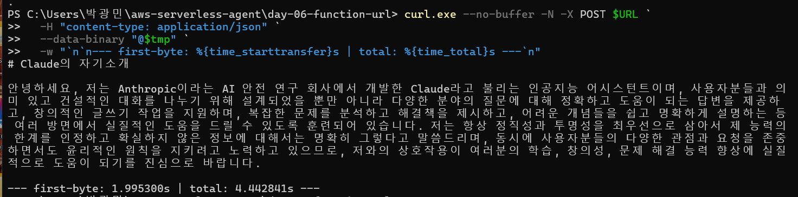
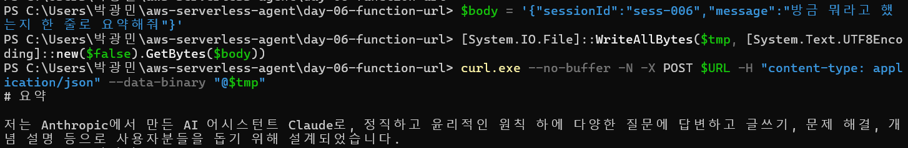
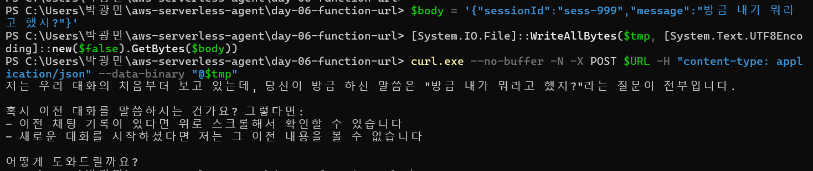

# Day 6: Lambda Function URL + Bedrock streaming

Phase 2 두 번째. Day 5 챗봇을 **HTTP 로 노출**하고, 동시에 Bedrock 응답을 **토큰 단위 스트리밍**으로 받는다.

원래 로드맵엔 "API Gateway 연동"이라 적혀 있었는데, 원본 레포(breath103/serverless-agent) 패턴을 확인해보니 **Lambda Function URL** 을 쓰고 있어서 그쪽으로 노선 변경. 이유는 아래에 정리.

## 🎯 학습 목표

- Lambda Function URL — API GW 없이 HTTP 엔드포인트
- `invokeMode: RESPONSE_STREAM` — Lambda 응답 스트리밍
- `awslambda.streamifyResponse` — Node.js streaming handler 패턴
- Bedrock `ConverseStreamCommand` — 토큰 단위 응답
- `lambda.Alias("live")` 를 끼우는 이유 (canary 배포 자리잡기)
- Function URL CORS 설정

## 📐 아키텍처

```
                 ┌─────────────────────────┐
                 │   ConversationsTable    │
                 │  PK: sessionId / SK: ts │
                 └──────────┬──────────────┘
                            │ Query / Put
                            ▼
curl ──HTTP POST──▶  Function URL  ──▶  ChatFunctionAlias("live")
   ◀── chunk stream ──                          │
                                                │ ConverseStream
                                                ▼
                                          AWS Bedrock
                                       (Claude Haiku 4.5)
```

호출 1회 흐름:
1. HTTP POST `{sessionId, message}` (Function URL)
2. Lambda: DDB Query (이력) → user 메시지 Put
3. Bedrock `ConverseStreamCommand` 호출
4. 청크 받는 즉시 `responseStream.write()` 로 클라이언트에 흘림
5. 스트림 종료 후 누적 응답을 assistant 메시지로 DDB Put

## 🧠 왜 API Gateway 가 아니라 Function URL 인가

처음엔 API Gateway HTTP API(v2) 로 가려고 했음. v1/v2 비교까지 했는데, **둘 다 응답 스트리밍을 지원 안 함**이 결정적. 챗봇은 토큰을 받자마자 흘려보내는 게 UX 핵심인데 API GW 를 끼면 Lambda 가 다 끝날 때까지 버퍼링됨.

| | Function URL | API GW v2 (HTTP) | API GW v1 (REST) |
|---|---|---|---|
| 비용 | Lambda 호출비만 | $1/M req | $3.50/M req |
| 응답 스트리밍 | ✅ | ❌ | ❌ |
| CORS | 옵션 한 줄 | 내장 | 직접 |
| 인증 | NONE / AWS_IAM | + JWT | + Cognito/Lambda Authorizer |
| API key / usage plan | ❌ | ❌ | ✅ |
| WAF / Custom domain | (CloudFront 경유) | (도메인 직접) | 풍부 |

**잃는 것**: API key 발급 + usage plan, request validator, WAF 직접 연결, 정교한 throttling.
**얻는 것**: 토큰 스트리밍, 단순함, 추가 요금 0.

원본 레포가 채팅 UX 때문에 Function URL 을 택했고, 우리도 같은 이유로 따라간다. CloudFront 뒤에 두면 도메인/캐싱/WAF 도 어차피 붙일 수 있음 (Phase 2 후반 / Phase 3).

## 📝 배운 것

### 1. `awslambda.streamifyResponse` — Lambda 가 글로벌로 주입하는 마커

Streaming Lambda 는 핸들러를 `awslambda.streamifyResponse(fn)` 로 감싸야 인식됨. `awslambda` 는 import 가 아니라 **Node.js Lambda 런타임이 글로벌로 꽂아주는 객체**. ESLint 가 `no-undef` 로 화내는데 글로벌 선언으로 무시하면 됨.

```js
export const handler = awslambda.streamifyResponse(
  async (event, responseStream, context) => {
    responseStream.write("hi ");
    responseStream.write("there");
    responseStream.end();
  }
);
```

`responseStream` 은 Node `Writable`. `.write()` 호출 시점에 클라이언트로 흐름.
`.end()` 를 안 부르면 Lambda 가 timeout 까지 매달려있음.

### 2. `lambda.Alias("live")` 를 굳이 끼우는 이유

Function URL 을 `fn.addFunctionUrl()` 로 함수 자체에 붙이면 항상 `$LATEST` 를 가리킴. 배포 중 잠깐 라우팅이 흔들릴 수 있고, canary 배포(트래픽 10% → 100% 점진 이전) 같은 패턴이 막힘.

`lambda.Alias` 위에 붙이면:
- URL 은 alias 가 가리키는 version 으로 고정 → 배포 중에도 안정
- `additionalVersions: [{ version, weight: 0.1 }]` 로 canary 슬롯 확보
- CodeDeploy traffic shifting 과 연결 가능

학습 단계라 canary 실제론 안 쓰지만, **원본도 동일 패턴**이라 그대로 따라둠. 나중에 안 끼우다가 끼우면 URL 이 바뀜 → 미리 끼우는 게 안전.

### 3. `InvokeMode.BUFFERED` vs `RESPONSE_STREAM`

```ts
addFunctionUrl({
  invokeMode: lambda.InvokeMode.RESPONSE_STREAM,
})
```

- `BUFFERED` (기본): Lambda 응답 다 받은 뒤 한 번에 전송 — 일반 REST
- `RESPONSE_STREAM`: 청크 단위 흘려보냄 — chunked transfer encoding

스트리밍 모드에서도 핸들러가 `responseStream` 을 안 쓰고 그냥 `return` 하면 그 값이 마지막에 한 번에 흐름. 핸들러 코드와 모드가 둘 다 맞아야 토큰 단위 응답이 됨.

### 4. `ConverseCommand` vs `ConverseStreamCommand`

| | ConverseCommand | ConverseStreamCommand |
|---|---|---|
| 응답 형태 | `{ output, usage }` | async iterable of events |
| IAM action | `bedrock:InvokeModel` | `bedrock:InvokeModelWithResponseStream` |
| 첫 토큰 도착 | ~1~5초 (전체 끝나야) | ~수백 ms |

```js
for await (const chunk of res.stream) {
  if (chunk.contentBlockDelta?.delta?.text) {
    responseStream.write(chunk.contentBlockDelta.delta.text);
  }
}
```

이벤트 종류: `messageStart`, `contentBlockDelta`, `contentBlockStop`, `messageStop`, `metadata(usage)`. text 청크는 `contentBlockDelta.delta.text` 에만 들어있고, `usage` 는 `metadata` 이벤트 한 번만 나옴 — DDB 저장용으로 따로 모아둬야 함.

### 5. user 메시지는 Bedrock 호출 **전에** Put

```
DDB Put (user) → Bedrock stream 시작 → 청크 흘리기 → DDB Put (assistant)
```

Bedrock 호출 도중/직후에 에러나도 user 입력은 이미 저장돼있어야 다음 요청 때 컨텍스트 잃지 않음. assistant 는 응답이 다 끝나야 알 수 있으니 마지막에 Put.

### 6. Function URL CORS — API GW 와 다르게 옵션 한 덩어리

```ts
cors: {
  allowedOrigins: ['*'],
  allowedMethods: [lambda.HttpMethod.POST],
  allowedHeaders: ['content-type'],
  maxAge: cdk.Duration.hours(1),
}
```

`allowedMethods` enum 에 `OPTIONS` 가 **없다** — Function URL 이 preflight 를 자동 처리하기 때문. 명시하면 `OPTIONS is not a valid enum value` 로 deploy 가 깨짐 (지원값: GET/PUT/HEAD/POST/PATCH/DELETE/*). day-9 에서 CloudFront 붙이면 origin 을 도메인으로 좁힐 것. 지금은 `*` 로 와이드 오픈.

### 7. event 포맷은 API GW v2 호환

Function URL 호출도 `{ version: "2.0", requestContext, body, headers, ... }` 모양. `body` 는 JSON 문자열이라 `JSON.parse(event.body)` 필수. 이 호환 덕분에 나중에 API GW 로 갈아끼워도 핸들러 거의 그대로.

## ▶️ 배포 & 테스트

```bash
cd day-06-function-url
npm install
npx cdk deploy
```

배포 후 출력:
```
Outputs:
Day06FunctionUrlStack.FunctionUrl = https://xxxx.lambda-url.us-east-1.on.aws/
```

### 스트리밍 확인 — `curl --no-buffer`

```bash
URL=https://xxxx.lambda-url.us-east-1.on.aws/

curl --no-buffer -N -X POST "$URL" \
  -H "content-type: application/json" \
  -d '{"sessionId":"sess-006","message":"긴 문장으로 자기소개 해줘"}'
```

`-N` / `--no-buffer` 둘 다 같은 의미 — curl 의 출력 버퍼링 끄기. 안 켜면 토막토막 들어와도 한꺼번에 보임.

### 멀티턴 — 같은 sessionId 로 한 번 더

```bash
curl --no-buffer -N -X POST "$URL" \
  -H "content-type: application/json" \
  -d '{"sessionId":"sess-006","message":"방금 뭐라고 했는지 한 줄 요약해봐"}'
```

2턴 응답이 1턴 내용을 언급하면 = DDB 이력 → Bedrock context 사이클 OK.

### ✅ 실제 검증 결과

**1) 스트리밍 동작 확인 — first-byte vs total 시간**

`-w "first-byte: %{time_starttransfer}s | total: %{time_total}s"` 로 측정:

```
--- first-byte: 1.995300s | total: 4.442841s ---
```

→ **첫 토큰까지 약 2초, 전체 응답까지 4.4초**. 그 사이 약 2.4초 동안 토큰이 청크 단위로 계속 흘러옴. Day 5 의 Buffered 였다면 두 값이 거의 같았을 것. **streaming OK**.



**2) 멀티턴 — 같은 sessionId 로 이력 누적**

1턴에서 자기소개를 길게 받은 뒤, 같은 `sess-006` 으로 "방금 뭐라고 했는지 한 줄로 요약해줘" 호출:

```
저는 Anthropic에서 만든 AI 어시스턴트 Claude로, 정직하고 윤리적인 원칙 하에
다양한 질문에 답변하고 글쓰기, 문제 해결, 개념 설명 등으로 사용자분들을
돕기 위해 설계되었습니다.
```

→ 1턴 자기소개 내용을 정확히 한 줄로 요약. **DDB 이력 → Bedrock context 사이클이 streaming 모드에서도 동작**.



**3) 세션 격리 — 다른 sessionId 는 모름**

같은 질문을 `sess-999` 로 호출:

```
저는 우리 대화의 처음부터 보고 있는데, 당신이 방금 하신 말씀은
"방금 내가 뭐라고 했지?"라는 질문이 전부입니다.
```

→ `sess-006` 의 자기소개 이력은 PK 단위로 격리되어 새 세션엔 한 줄도 안 넘어감. Day 5 와 동일하게 **세션 격리 보장**.



---

### PowerShell 한글 payload 함정 (day-5 README 에서도 언급)

`curl.exe` (Windows) 로 한글 보낼 땐 BOM/인코딩 깨짐 주의. 가장 안전한 패턴:

```powershell
$body = '{"sessionId":"sess-006","message":"안녕"}'
$bytes = [System.Text.UTF8Encoding]::new($false).GetBytes($body)
[System.IO.File]::WriteAllBytes("payload.json", $bytes)
curl.exe --no-buffer -N -X POST $URL -H "content-type: application/json" --data-binary "@payload.json"
```

## 🐛 막힐 만한 곳

### 응답이 토막이 아니라 한 번에 옴

- `invokeMode` 가 `BUFFERED` 임 → CDK 스택에서 `RESPONSE_STREAM` 확인
- 클라이언트 버퍼링 — `curl -N` / `--no-buffer` 빠뜨림
- CloudFront / 프록시 끼면 자동 버퍼링되는 경우 있음 (Phase 3 에서 다룸)

### `AccessDeniedException: bedrock:InvokeModelWithResponseStream`

Day 5 의 `InvokeModel` 만 허용하면 스트림 호출은 거부됨. 두 action 모두 부착:
```ts
actions: ['bedrock:InvokeModel', 'bedrock:InvokeModelWithResponseStream'],
```

### Function URL 호출 시 응답이 비어있고 Lambda 는 timeout

- `responseStream.end()` 호출 누락 → 핸들러가 끝나도 stream 이 안 닫혀서 매달림
- try/finally 로 `end()` 보장하는 게 안전

### `awslambda is not defined` (로컬 테스트)

런타임 글로벌이라 로컬 Node 에선 당연히 없음. 로컬 단위 테스트가 필요하면 mock 글로벌 박아주거나, streaming 핸들러는 SAM/cdk integ 로 검증.

## 💰 비용 감각

호출 1회당:
- Function URL: **추가 비용 없음** (Lambda 호출비에 포함)
- Lambda: ~$0.0000004 (512MB × ~2초 가정)
- DDB Query 1 + Put 2: ~$0.0000035
- Bedrock Haiku 4.5 (200 in + 200 out): ~$0.0014 (≈ 2원)

API GW 끼웠으면 호출당 +$0.000001 (HTTP API) ~ +$0.0000035 (REST) 추가. 학습 규모에선 무시할 수준이지만, **억 단위 호출에선 Function URL 이 의미 있게 쌈**.

## 🔜 다음 단계 (Day 7)

- 대화 히스토리 조회 API (GET) — 지금은 chat POST 하나뿐
- "가장 최근 N턴" 정확히 가져오기 (`ScanIndexForward: false` + reverse) — Day 5 README 에서 미뤄둔 숙제
- 멀티 라우트로 늘리면 자연스레 Hono 같은 라우터 필요 → 원본도 그렇게 감
