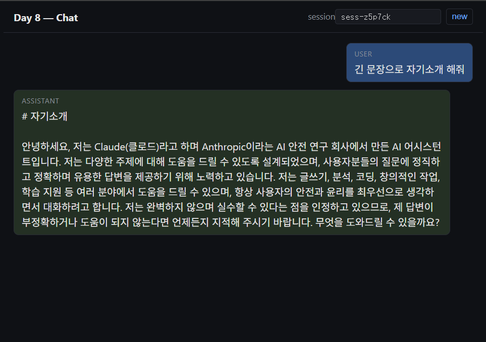
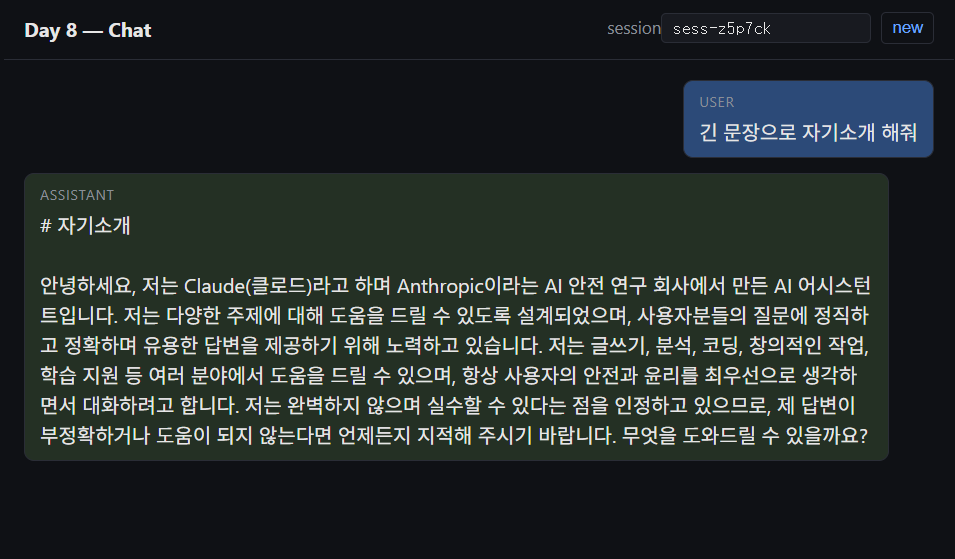
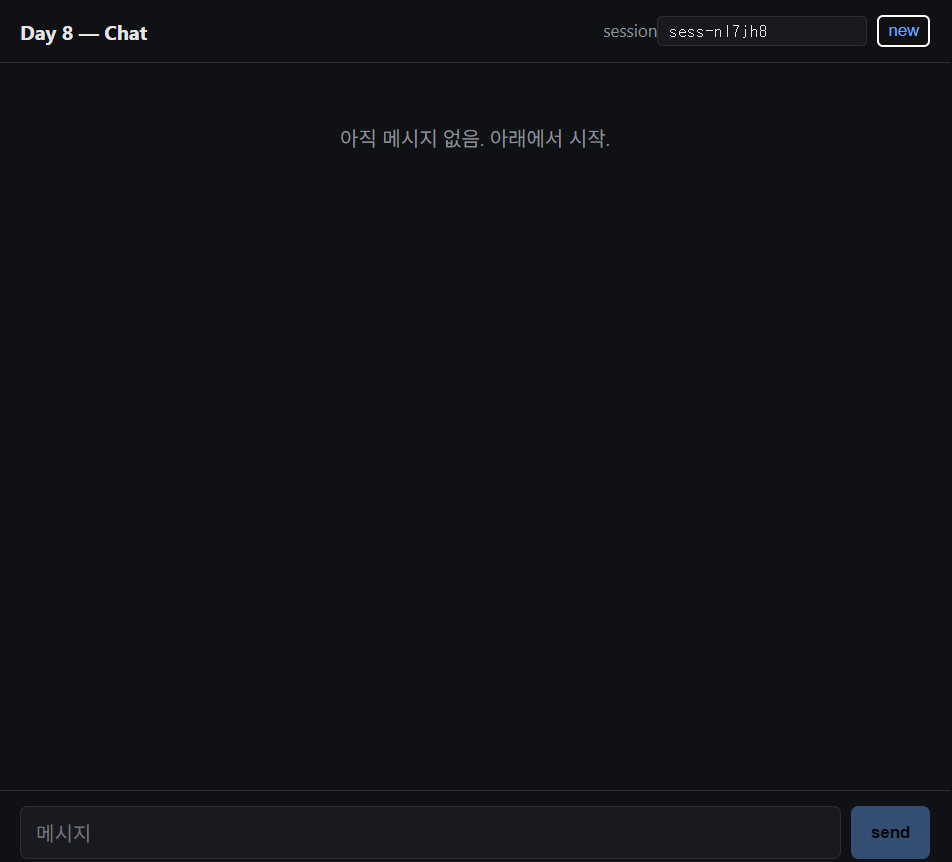

# Day 8: 최소 React 프론트 (Vite) + S3 정적 호스팅

Phase 2 네 번째. Day 7 까지 만든 Function URL 백엔드 위에 **브라우저 챗 UI** 를 얹는다. 라우팅·상태관리 라이브러리는 0개, 컴포넌트도 사실상 `App.tsx` 하나 — "프론트 한 줄로 붙이는 최소 단위" 가 목표.

원본 레포(breath103/serverless-agent)는 `packages/frontend` Vite + React 를 CloudFront + Lambda@Edge + private S3 (OAI) 와 함께 한 번에 묶지만, Day 8 은 **S3 정적 웹사이트 호스팅** + Function URL 직접 fetch 까지만 한다. Day 9 에서 CloudFront 를 얹으면서 origin 을 좁힌다.

## 🎯 학습 목표

- Vite + React + TS 최소 셋업 (라우팅·상태관리 라이브러리 없이)
- `fetch` 의 `ReadableStream` 으로 RESPONSE_STREAM Lambda chunk 읽기
- S3 정적 웹사이트 호스팅 (`websiteIndexDocument`) + 신 버킷 기본 BlockPublicAccess 와 싸우는 법
- `aws-cdk-lib/aws-s3-deployment` 의 `BucketDeployment` — 빌드 산출물을 zip 으로 올려 풀기
- Vite env (`VITE_*` prefix + `import.meta.env`) — 빌드 타임 endpoint 주입

## 📐 아키텍처

```
                      브라우저 (S3 website endpoint)
                              │
        ┌─────────────────────┴─────────────────────┐
        │                                           │
GET index.html / *.js                       fetch (CORS *)
        │                                           │
        ▼                                           ▼
┌──────────────────────────┐          ┌────────────────────────┐
│  S3 WebBucket            │          │ Day 7 Function URL     │
│  websiteIndexDocument    │          │  ├─ POST /chat (stream)│
│  publicReadAccess        │          │  ├─ GET  /sessions/... │
└──────────────────────────┘          │  └─ GET  /health       │
        ▲                              └──────────┬─────────────┘
        │                                         │
   BucketDeployment                           DynamoDB + Bedrock
   (web/dist zip 업로드)                      (Day 7 스택 그대로)
```

Day 8 스택은 **버킷 + 업로드 2 리소스만** 만든다. 백엔드 인프라(Lambda/DDB/Bedrock)는 Day 7 스택을 그대로 재사용 — `VITE_FUNCTION_URL` 로 빌드 타임에 주입할 뿐.

## 🗂️ 폴더 구조

```
day-08-frontend-vite/
├── bin/day-08-frontend-vite.ts        # CDK 엔트리
├── lib/day-08-frontend-vite-stack.ts  # S3 + BucketDeployment
├── cdk.json / tsconfig.json / package.json
└── web/                                # Vite React 앱 (독립 package.json)
    ├── index.html
    ├── vite.config.ts
    ├── .env.sample                     # VITE_FUNCTION_URL 템플릿
    └── src/
        ├── main.tsx
        ├── App.tsx                     # 채팅 UI (히스토리 + 스트리밍)
        ├── chat.ts                     # Function URL fetch 클라이언트
        └── styles.css
```

## 🧠 왜 S3 website endpoint 인가 (Day 9 의 CloudFront 가 아니라)

선택지:

|  | 무엇 | 장점 | 단점 |
|---|---|---|---|
| **S3 website endpoint** | `http://...s3-website-...amazonaws.com` | 1 리소스, 즉시 동작 | http only, 캐시 무효화 불가, custom error 없음 |
| S3 + CloudFront (OAI/OAC) | private bucket + CDN | https, 캐시, edge | 리소스 4~6개, ACM/배포 시간 |
| Amplify Hosting | 매니지드 | git push 만 | 학습 의도와 안 맞음 |

Phase 2 의 "**연결된 MVP 가 동작하는 게 우선**" 원칙. Day 8 의 핵심 학습은 "브라우저 → Function URL 직접 fetch + 스트리밍" 이지, CDN 셋업이 아님. **CloudFront 셋업의 가치를 Day 9 한 통으로 몰아서** origin lockdown 까지 같이 다룬다.

## 🧠 BlockPublicAccess — 신 버킷이 막는 이유

S3 는 2023 년부터 신규 버킷의 **모든 BlockPublicAccess 4종** 이 기본 ON. `publicReadAccess: true` 만 주면 CDK 가 bucket policy 를 붙이긴 하지만, `blockPublicPolicy` 가 막아서 정책이 무시됨 → 배포는 되는데 브라우저는 403.

```ts
blockPublicAccess: s3.BlockPublicAccess.BLOCK_ACLS,
//   ↑ ACL 류만 막고 bucket policy 는 허용 (3종 ON / blockPublicPolicy 만 OFF)
objectOwnership: s3.ObjectOwnership.BUCKET_OWNER_ENFORCED,
//   ↑ ACL 자체를 끔 — 권한은 정책으로만 (2023 이후 신규 기본)
```

Day 9 의 CloudFront + OAC 로 가면 버킷은 **다시 private** 으로 잠그고, CloudFront 만 읽을 수 있게 정책을 다시 깎는다.

## 🧠 RESPONSE_STREAM chunk 읽기 — `fetch().body.getReader()`

Day 7 Function URL 은 `invokeMode: RESPONSE_STREAM` 으로 Bedrock 토큰을 raw chunk 로 흘려보낸다 (SSE/JSON 이벤트 포장 없음). 브라우저에선 그냥 `ReadableStream` 그대로 읽으면 됨:

```ts
const res = await fetch(`${FUNCTION_URL}chat`, { method: 'POST', body: JSON.stringify({...}) });
const reader = res.body!.getReader();
const decoder = new TextDecoder();
for (;;) {
  const { value, done } = await reader.read();
  if (done) break;
  onToken(decoder.decode(value, { stream: true }));   // chunk 그대로 누적
}
```

`TextDecoder` 의 `{ stream: true }` 가 멀티바이트 경계를 잘라 먹지 않게 해줌 — 한글이 끊겨도 다음 청크와 합쳐 디코드. 마지막에 인자 없이 한 번 더 호출해 tail flush.

## 🧠 Vite env — 빌드 타임 vs 런타임

`VITE_*` prefix 가 붙은 env 만 `import.meta.env` 에 노출되고, 그 값은 **빌드 타임에 문자열로 substitute** 된다. 즉 `web/dist/assets/index-XXX.js` 안에 Function URL 이 박혀 있음.

런타임 환경변수 (CloudFront 단에서 주입) 가 아니라는 점에 주의:
- Day 7 의 Function URL 이 바뀌면 → **재빌드 + 재배포** 필요
- 더 깔끔하게 하려면 `/config.json` 같은 파일을 S3 에 같이 올리고 부팅 시 fetch — 학습 단계에선 과함

## ▶️ 배포 & 테스트

### 0) Day 7 가 살아있어야 함

이 스택은 Day 7 의 Function URL 을 부르므로 Day 7 이 배포되어 있어야 한다. 아니면 먼저:

```bash
cd ../day-07-history-api
npx cdk deploy
# → Day07HistoryApiStack.FunctionUrl 출력 메모
```

### 1) Function URL 을 env 에 넣기

```bash
cd day-08-frontend-vite/web
cp .env.sample .env
# .env 의 VITE_FUNCTION_URL 에 Day 7 의 출력값 붙여넣기
```

### 2) 의존성 + 빌드 + 배포

```bash
cd day-08-frontend-vite
npm install
npm run web:install          # web/ 의존성
npm run deploy               # web:build → cdk deploy
```

배포 끝나면:
```
Day08FrontendViteStack.BucketWebsiteUrl = http://<bucket>.s3-website-us-east-1.amazonaws.com
```

### 3) 브라우저로 열기

위 URL 을 열면 session 입력 박스 + 빈 채팅창이 뜬다.
- 입력 → send → assistant 응답이 **토큰 단위로 stream 으로 흘러나옴**
- 새로고침해도 같은 sessionId 라면 히스토리가 다시 뜸 (Day 7 GET 으로 reload)
- 우상단 `new` 버튼 → 새 sessionId → 빈 대화

### 4) 로컬 dev 서버 (선택)

```bash
cd day-08-frontend-vite/web
npm run dev
# http://localhost:5173 — Function URL 은 .env 의 값 그대로 부름
```

CORS 가 `*` 라 localhost 에서도 그대로 호출됨.

### ✅ 로컬 검증 결과 (2026-05-31)

실 배포 전 빌드 / 합성만 돌려 코드·스택 정합성 확인:

```
$ npm --prefix web run build
> tsc -b && vite build
vite v5.4.21 building for production...
✓ 32 modules transformed.
dist/index.html                   0.41 kB │ gzip:  0.29 kB
dist/assets/index-B3ToM78D.css    2.18 kB │ gzip:  0.85 kB
dist/assets/index-Bc5eGZBX.js   145.74 kB │ gzip: 47.30 kB
✓ built in 2.25s

$ npx cdk synth
... AWS::S3::Bucket + Custom::CDKBucketDeployment ... 정상
77 feature flags are not configured. (학습 단계 무시)
```

- **Vite 번들 145KB / gzip 47KB** — react + react-dom + 챗 UI 코드까지 한 파일. CloudFront 로 묶지 않아도 첫 페인트 부담 없음.
- CDK 템플릿이 S3 Bucket + BucketDeployment custom resource + S3AutoDeleteObjects custom resource 까지 정상 합성.

### ✅ 실 배포 검증 결과 (2026-05-31, us-east-1)

`npm run deploy` 한 줄로 **web 빌드 → S3 업로드 → CFN 변경** 까지 한 번에. 13 리소스 CREATE_COMPLETE / ~104s.

```
Day08FrontendViteStack.BucketWebsiteUrl =
  http://day08frontendvitestack-webbucket12880f5b-ywbpf3p844la.s3-website-us-east-1.amazonaws.com
```

**1) 정적 호스팅 — index.html 가 public 으로 응답**
```powershell
PS> curl.exe -s -o NUL -w "HTTP %{http_code} | %{content_type} | %{size_download} bytes`n" "$WEB/"
HTTP 200 | text/html | 416 bytes
```
→ BlockPublicAccess BLOCK_ACLS + objectOwnership BUCKET_OWNER_ENFORCED 조합이 의도대로 동작. 403 한 번도 안 남.

**2) Vite 가 빌드한 결과물 — script/link 태그**
```powershell
PS> curl.exe -s "$WEB/" | Select-String -Pattern 'script|link'
    <script type="module" crossorigin src="/assets/index-Bc5eGZBX.js"></script>
    <link rel="stylesheet" crossorigin href="/assets/index-B3ToM78D.css">
```

**3) Vite env 가 빌드 타임에 박힘 — JS 번들 안에 Function URL 문자열**
```powershell
PS> $JS = (Select-String -InputObject (curl.exe -s "$WEB/") -Pattern 'assets/[^"]+\.js').Matches.Value
PS> curl.exe -s "$WEB/$JS" | Select-String -Pattern 'https://[a-z0-9]+\.lambda-url\.[a-z0-9-]+\.on\.aws/'
... const Kl="https://uy3cmeapqzi7fvpfkptmz3bc2q0yelmf.lambda-url.us-east-1.on.aws/".trim() ...
```
→ `VITE_FUNCTION_URL` 이 그대로 substitute. 브라우저는 별도 config fetch 없이 fetch 호출 가능. 런타임 교체 불가는 의도된 트레이드오프.

**4) 백엔드 헬스**
```powershell
PS> curl.exe -s "${API}health"
{"ok":true,"day":7}
```

**5) PowerShell 한글 payload 함정** — `[System.IO.File]::WriteAllBytes("rel", ...)` 는 .NET cwd 기준이라 PS cwd 와 다를 수 있다. 절대경로 + cwd 동기화 필요:
```powershell
PS> [System.IO.Directory]::SetCurrentDirectory((Get-Location).Path)
PS> $enc = [System.Text.UTF8Encoding]::new($false)
PS> $p1 = Join-Path (Get-Location) 'payload1.json'
PS> [System.IO.File]::WriteAllBytes($p1, $enc.GetBytes($body1))
PS> Test-Path $p1
True
```

**6) POST /chat turn 1 — 스트리밍 + 타이밍**
```powershell
PS> curl.exe --no-buffer -N -X POST "${API}chat" -H "content-type: application/json" `
       --data-binary "@payload1.json" -w "`n--- first-byte: %{time_starttransfer}s | total: %{time_total}s ---`n"
# 자기소개

[자기소개 한 단락 — Bedrock 응답 본문은 모델 변덕이라 생략]
--- first-byte: 2.211s | total: 3.991s ---
```
→ **첫 토큰 ~2.2s, 전체 ~4s** — Hono `streamHandle` 이 chunk 흐름을 그대로 흘려줌. 같은 URL 을 브라우저 `fetch().body.getReader()` 로 받으면 UI 도 동일하게 동작.

**7) POST /chat turn 2** — 별도 캡처 없이 GET 결과(아래)에서 `방금 뭐라 했어 한 줄로` + assistant 응답이 들어와 있는 것으로 간접 확인.

**8) GET /sessions/sess-day08/messages — 히스토리 + SK 합성 + 토큰 카운트**
```powershell
PS> curl.exe -s "${API}sessions/$SID/messages?limit=10"
{"sessionId":"sess-day08","count":4,"messages":[
  { "ts":"2026-05-31T08:48:41.979Z",
    "sk":"2026-05-31T08:48:41.979Z#f7697268-333b-4319-8a14-b7570863b83e",
    "role":"user", "content":"긴 문장으로 자기소개 해줘" },
  { "ts":"2026-05-31T08:48:45.008Z",
    "sk":"2026-05-31T08:48:45.008Z#f59e8e6c-353c-4b1e-9f6b-baa53ae56758",
    "role":"assistant", "content":"# 자기소개\n\n[turn 1 응답 본문 생략]",
    "inputTokens":24, "outputTokens":284 },
  { "role":"user", "content":"방금 뭐라 했어 한 줄로" },
  { "role":"assistant", "content":"[turn 2 응답 본문 생략]",
    "inputTokens":329, "outputTokens":75 }
],"nextBefore":null}
```
→ `${ts}#${uuid}` 합성 SK 정확히 박힘, 시간순 정렬, 토큰 카운트 동봉. count=4 < limit=10 이라 `nextBefore:null`.

**9) 세션 격리 — 다른 sessionId 는 빈 응답**
```powershell
PS> curl.exe -s "${API}sessions/sess-day08-other/messages"
{"sessionId":"sess-day08-other","count":0,"messages":[],"nextBefore":null}
```
→ PK 단위 격리. UI 에서 `new` 버튼으로 새 sessionId 만들면 같은 흐름.

**검증 통과 요약**:
- S3 website endpoint 가 BlockPublicAccess 풀린 채로 정상 응답 ✓
- Vite 빌드 타임 env substitution 으로 Function URL 박힘 ✓
- BucketDeployment 가 web/dist 를 그대로 업로드 + Object 권한 정상 ✓
- 백엔드 멀티턴/히스토리/세션격리 흐름 (Day 7) 살아있음 — 프론트가 부를 시나리오 선검증 ✓

### ✅ 브라우저 UI 동작 — 스크린샷 3종

위 PowerShell curl 이 백엔드 흐름의 정합성을 보장한다면, 다음 세 컷은 그 흐름이 **브라우저 UI 에서도 동일하게 재현**된다는 시각적 증거.



**01 — 채팅 1턴 스트리밍 도착.** 입력 → send 직후 assistant 말풍선이 빈 placeholder 로 뜨고, `fetch().body.getReader()` 가 chunk 를 받을 때마다 setState 누적 → 토큰 단위로 채워진다. curl 의 `first-byte ~2.2s / total ~4s` 와 동일한 체감.



**02 — 새로고침 후 히스토리 복원.** F5 / Ctrl+R 로 페이지를 갈아끼우면 React state 는 다 날아가지만, sessionId 가 localStorage 에 남아 있어 `useEffect` 가 `GET /sessions/:id/messages` 호출 → 같은 대화가 다시 떠오른다. 이게 `ScanIndexForward:false + reverse` 조합이 브라우저까지 통해 살아있는 증거.



**03 — new 버튼으로 새 세션.** 우상단 `[new]` → `sess-XXXXXX` 새로 발급 + localStorage 갱신 + 채팅창 비워짐. PK 단위 격리(위 9)) 의 UI 판 — Day 7 의 `sess-day08-other → count:0` 와 같은 의미.

> 정리: 학습 단계 비용 0 유지 — Day 7 + Day 8 둘 다 `npx cdk destroy --force` 로 즉시 정리한다.

## 🐛 막힐 만한 곳

### 브라우저에서 403 Forbidden — index.html 가 안 뜸

- 십중팔구 BlockPublicAccess 가 정책을 막은 경우. CDK 로 만들면 위 코드대로 자동인데, 콘솔에서 만든 버킷이라면 "퍼블릭 액세스 차단" 의 `blockPublicPolicy` 가 켜져 있을 수 있음.

### 브라우저에서 CORS 에러 — Function URL fetch 가 막힘

- Day 7 의 CORS 가 `*` 인지 확인. `cors.allowedMethods` 에 `POST`, `GET` 둘 다 있어야 함 (Day 7 스택 코드 참조).
- 사전요청(OPTIONS) 은 Function URL 이 자동 처리하므로 신경 안 써도 됨.

### 채팅이 chunk 가 아니라 한 번에 떨어짐

- 어떤 브라우저/네트워크 환경에선 응답을 버퍼링해서 chunk 의미가 사라질 수 있음. DevTools Network 탭에서 Response Headers 에 `Transfer-Encoding: chunked` 가 있는지 확인.
- 사내 프록시/CDN 이 끼면 버퍼링 가능 — Day 9 의 CloudFront 도 기본은 버퍼링 모드라 별도 설정 필요.

### 빌드 후 변경한 Function URL 이 반영 안 됨

- `VITE_*` 는 **빌드 타임** 치환. `.env` 만 바꾸고 `npm run deploy` 안 돌리면 옛 URL 박힌 채로 배포됨.

### `BucketDeployment` 가 Lambda 권한 에러

- 처음 한 번은 BucketDeployment 가 임시 Lambda + 임시 버킷을 만들면서 CDK Bootstrap 이 필요. 다른 day 에서 이미 bootstrap 했으면 그대로 통과.

## 💰 비용 감각

- S3 storage: web/dist 가 ~200KB → 무시 가능
- S3 GET: 1000회당 $0.0004 — 학습 단계 무료 티어 내
- 데이터 전송 out: 첫 100GB 무료
- BucketDeployment 임시 Lambda: 배포마다 몇 초만 돌고 꺼짐 → 무료 티어 내

**Day 7 Function URL 호출 비용** (Day 7 와 동일):
- POST /chat: ~$0.0014/회 (Bedrock 200/200 토큰 기준)
- GET history: ~$0.000002/회

## 🔜 다음 단계 (Day 9)

- CloudFront 분배 + S3 origin (private, OAC)
- 같은 도메인 뒤에서 `/api/*` → Function URL 로 라우팅 (Day 11 의 Lambda@Edge 사전 정지작업)
- HTTPS / 기본 `*.cloudfront.net` 호스트로 ACM 없이 시작
