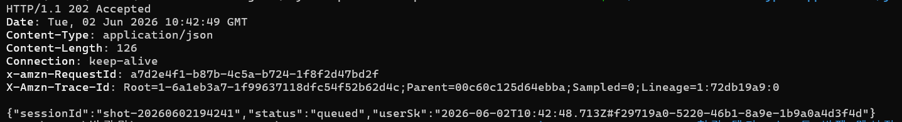
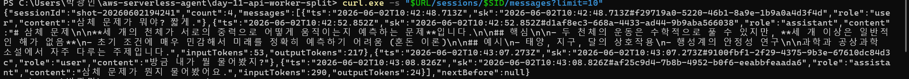
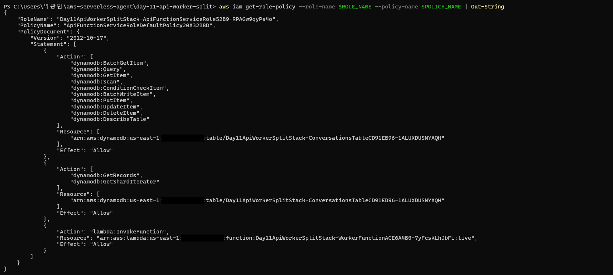
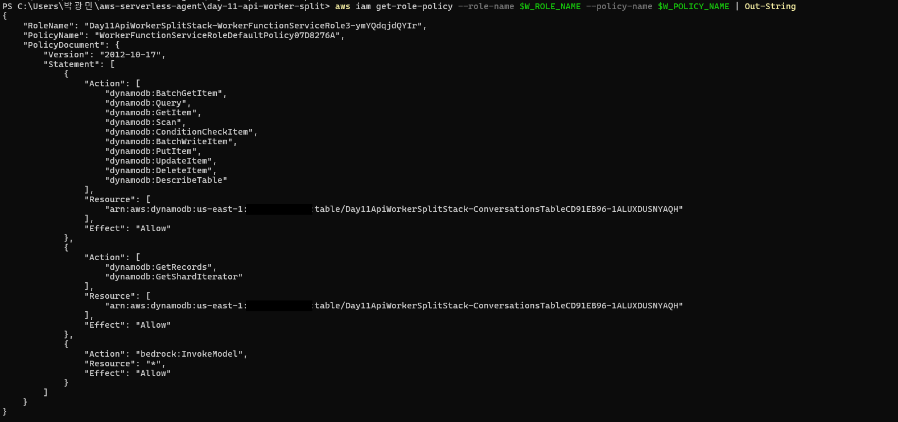

# Day 11: API ↔ Worker Lambda 분리 — Async Invoke (SQS 없음)

Phase 3 의 시작. Day 7 의 **단일 Lambda 안에서 모든 걸 하던 구조** 를 **API Lambda + Worker Lambda 둘로 쪼개고**, 둘 사이를 **`InvocationType: Event` async invoke** 한 줄로 잇는다.

> 원본 [breath103/serverless-agent](https://github.com/breath103/serverless-agent) 의 `packages/backend/scripts/lib/backend-stack.ts` 가 정확히 이 모양 — `Handler` 람다와 `Worker` 람다, 그리고 `workerAlias.grantInvoke(fn)` 한 줄.

## 🎯 이 day 가 답하는 것

1. **"Lambda 가 60초 넘게 일해야 하면?"** — Phase 2 회고가 남긴 첫 질문. API 는 즉시 응답하고 무거운 일은 Worker 가 떠안는다.
2. **SQS 없이 어떻게 async dispatch 하는가** — Lambda 자체가 async invoke 큐를 제공한다 (`InvocationType: Event`).
3. **두 Lambda 사이의 권한·환경변수 와이어링** — 원본의 `workerAlias.grantInvoke(api)` + `AGENT_WORKER_FUNCTION_NAME` env.

## 🪜 Day 7 → Day 11 diff

| 측면 | Day 7 | Day 11 |
|---|---|---|
| Lambda 수 | 1개 (Chat) | 2개 (Api + Worker) |
| `/chat` 응답 | Bedrock 토큰 스트림 (RESPONSE_STREAM) | **202 Accepted JSON** (BUFFERED) |
| Bedrock 호출 위치 | Chat Lambda 안 | **Worker Lambda 안** |
| API → Worker 트리거 | (없음) | `Lambda.InvokeCommand` + `InvocationType.Event` |
| 결과 확인 | HTTP 스트림 청크 | `GET /sessions/:id/messages` 폴링 |
| Function URL invokeMode | `RESPONSE_STREAM` | `BUFFERED` |
| Bedrock 권한 | Chat Lambda 에 부착 | **Worker 에만 부착** (API 는 모델을 모름) |
| Worker invoke 권한 | — | `workerAlias.grantInvoke(apiFn)` |

**규칙: 매일 한 가지만 더하기**. Day 11 은 "쪼개기 + async" 한 가지. 테이블 분리(Day 12), Agent Loop(Day 13), MQTT(Day 14) 는 다음 day 들의 몫.

## 🏗️ 아키텍처

```
[curl/브라우저]
     │  POST /chat   { sessionId, message }
     ▼
[CloudFront 없음 — 단일 도메인은 Day 16 에서 Lambda@Edge 와 함께 재구성]
     │
     ▼  Function URL (BUFFERED, CORS *)
┌──────────────────────────────────────┐
│  ApiFunction (Hono)                  │
│   1) validate                        │
│   2) DDB Put (user msg)              │
│   3) Lambda.Invoke(workerAlias,      │
│                    Event,            │
│                    {type:"run_chat"})│
│   4) return 202                      │
└──────────────────────────────────────┘
     │ async (fire-and-forget)
     ▼
┌──────────────────────────────────────┐
│  WorkerFunction                      │
│   1) DDB Query (history N턴)         │
│   2) Bedrock Converse (non-stream)   │
│   3) DDB Put (assistant msg)         │
└──────────────────────────────────────┘
     │
     ▼
[ConversationsTable]
     ▲
     │  GET /sessions/:id/messages
     └────── ApiFunction (같은 람다, 다른 라우트)
```

## 🧩 원본과의 매핑

| 우리 (Day 11) | 원본 (`packages/backend/scripts/lib/backend-stack.ts`) |
|---|---|
| `ApiFunction` (NodejsFunction, NODEJS_20_X, 30s, 512MB) | `Handler` (NODEJS_24_X, 30s, 1769MB) |
| `WorkerFunction` (NodejsFunction, NODEJS_20_X, 60s, 512MB) | `Worker` (NODEJS_24_X, 5min, 512MB) |
| `lambda/api.mjs` ↔ `lambda/worker.mjs` (별도 번들) | 같은 dist 안 `lambda-api/handler.handler` ↔ `worker/handler.handler` |
| `workerAlias.grantInvoke(apiFn)` | `workerAlias.grantInvoke(fn)` (동일) |
| env `AGENT_WORKER_FUNCTION_NAME` = `workerAlias.functionArn` | 동일 |
| payload `{type:"run_chat", sessionId, message, userSk}` | 동일 discriminated union 패턴 (`{type, ...}`) |

**의도적 차이**: 원본은 Worker timeout 을 5분 둔다 — Agent Loop 가 tool 을 여러 번 호출하는 경우 대비. 우리는 Day 13 에서 그 패턴이 들어올 때 같이 늘린다. 오늘은 Bedrock 한 번 호출만 하니 60s 로 충분.

## 🚀 배포 + 검증 절차

### 1) 배포

```powershell
cd day-11-api-worker-split
npm install
npm run deploy
# CDK output 에서 ApiUrl, ApiFunctionName, WorkerFunctionName, TableName 메모
```

### 2) `curl` 로 POST → 202 확인 (스트림 없음)

```powershell
$URL    = "<ApiUrl>"
$SID    = "test-$(Get-Date -Format 'yyyyMMddHHmmss')"
$enc    = [System.Text.UTF8Encoding]::new($false)
[System.IO.Directory]::SetCurrentDirectory((Get-Location).Path)

$payload = @{ sessionId = $SID; message = "안녕! 너는 누구야?" } | ConvertTo-Json -Compress
[System.IO.File]::WriteAllBytes("payload.json", $enc.GetBytes($payload))

curl.exe -i -X POST "$URL/chat" `
  -H "content-type: application/json" `
  --data-binary "@payload.json"

# 기대: HTTP/1.1 202
# body : { "sessionId":"test-...", "status":"queued", "userSk":"2026-..." }
```

### 3) 잠시 (보통 3~6초) 후 히스토리 GET — Worker 결과 확인

```powershell
Start-Sleep -Seconds 8
curl.exe "$URL/sessions/$SID/messages?limit=10"

# 기대: messages 배열에 user + assistant 두 개
#   [{ role:"user", content:"안녕! 너는 누구야?" },
#    { role:"assistant", content:"안녕하세요! 저는 Anthropic 에서 만든 Claude 입니다..." }]
```

assistant 가 안 보이면 Worker 가 아직 안 끝났거나 에러. CloudWatch 로:

```powershell
$WORKER = "<WorkerFunctionName>"
aws logs tail "/aws/lambda/$WORKER" --since 5m --follow
```

### 4) 빠른 health 체크

```powershell
curl.exe "$URL/health"
# {"ok":true,"day":11,"role":"api"}
```

### 5) 정리

```powershell
npx cdk destroy --force
```

## 📸 실배포 검증 결과 (2026-06-02)

직접 us-east-1 에 배포 후 4종 검증 통과. 스크린샷 4컷이 각각 다른 주장을 증명한다.

### #1 — API 는 즉시 응답 (`/chat` → HTTP 202)



POST `/chat` 가 1.1초 (cold start 포함) 만에 `202 Accepted` + `{status:"queued", userSk:...}` 를 돌려줌. **Bedrock 응답 대기를 안 함** — Worker 는 이미 `InvocationType:Event` 로 fire-and-forget 호출됨.

### #2 — 멀티턴 컨텍스트가 진짜로 누적된다 (`inputTokens` 가 증거)



같은 sessionId 로 2번 POST 한 뒤 GET. `count:4` (user+assistant×2) 가 시간순으로 정렬되어 옴. **결정적 숫자: 두 번째 assistant 의 `inputTokens:290`** — 빈 세션 첫 호출은 53 였는데 290 으로 뛰었다 = Worker 가 DDB 에서 직전 user+assistant 를 Query 해서 Bedrock messages 배열에 넣었다는 증거. **두 람다가 DDB 를 공유 상태 저장소로 정확히 작동**.

### #3 — API IAM 에 Bedrock 권한 없음 (책임 분리)



`aws iam get-role-policy` 결과:
- ✅ `dynamodb:Query/Put/...` on `ConversationsTable`
- ✅ `lambda:InvokeFunction` on **`WorkerFunction...:live` alias 한정** (`$LATEST` 못 부름)
- ❌ `bedrock:*` 한 줄도 없음

→ API Lambda 의 코드 안에 `BedrockRuntimeClient` 를 박아도 IAM 단계에서 거부됨. **책임 분리가 정책 차원에서 강제**.

### #4 — Worker IAM 에는 Bedrock 있음, Lambda Invoke 는 없음



- ✅ `dynamodb:Query/Put/...` (히스토리 Query + assistant Put)
- ✅ `bedrock:InvokeModel` on `*` (모델 호출 전담)
- ❌ `lambda:InvokeFunction` 없음 → **Worker 는 다른 람다 못 부름**. 추후 Worker 가 다른 Worker 를 fan-out 하려면 새로 grant 필요 (의도적 제약)

> Account ID 는 가렸지만 IAM 정책의 모든 의미 정보는 남김. AWS 공식상 Account ID 는 시크릿 아니지만 공개 레포 관행으로 마스킹.

### 측정치 요약

| 항목 | 값 | 출처 |
|---|---|---|
| API cold start (POST 202 latency) | 1116 ms | curl `--max-time` 측정 |
| Worker 실행 시간 (cold) | 4271 ms | CloudWatch REPORT |
| Worker 실행 시간 (warm) | 3828 ms | CloudWatch REPORT |
| Worker Init Duration | 627 ms | CloudWatch INIT_START |
| Worker Max Memory Used | 104 MB / 512 MB | CloudWatch REPORT |
| Bedrock 호출 1턴 input tokens | 53 (빈 세션) | response body |
| Bedrock 호출 2턴 input tokens | 290 (1턴 누적) | response body — **멀티턴 증거** |

## ⚠️ 함정 / 트러블슈팅 (Day 11 발견분)

| # | 함정 | 원인 | 회피 |
|---|---|---|---|
| 13 | `InvokeCommand` 에 `InvocationType` 안 주면 기본 RequestResponse → API 가 Worker 끝날 때까지 30s 기다림 → 원래 의도(즉시 202) 깨짐 | SDK 기본값이 RequestResponse | 항상 `InvocationType: InvocationType.Event` 명시 |
| 14 | Worker 가 `messages[]` 첫 원소를 user 로 보장 못 함 → Bedrock `ValidationException` | API 가 Put 실패한 채로 Worker invoke 했거나 빈 세션 | Worker 안에 head=='user' 가드, 그리고 항상 user Put → invoke 순서 유지 |
| 15 | `workerFn.grantInvoke(apiFn)` 로 함수 자체에 grant 걸면 `$LATEST` 만 호출 가능 — alias ARN 으로 invoke 시 권한 거부 | Lambda 권한은 qualifier 단위 | **`workerAlias.grantInvoke(apiFn)`** 처럼 alias 에 grant + env 도 `workerAlias.functionArn` |
| 16 | API 의 IAM 에 `bedrock:*` 남겨두면 책임 분리 의미 흐려짐 | 이전 day 의 IAM 패턴을 복붙 | API 스택에는 Bedrock 권한을 아예 안 둠 (오늘 명시적으로 제거) |

> 함정 12까지는 Phase 2 회고 README 에 정리. Day 11 부터 13~ 번호로 누적.

## 🧠 남긴 숙제 → 다음 day 들로

| 숙제 | 어디서 | 어떻게 |
|---|---|---|
| 단일 테이블 → 도메인별 분리 | Day 12 | `ConversationsTable` 1개 → `Users/Sessions/Messages` 3개 |
| Worker 안에 Agent Loop (`toolUse` 반복) | Day 13 | Worker timeout 60s → 5min, `executeCode` 단일 도구 |
| Worker 출력이 어디로도 안 흐름 (HTTP 응답은 API 가 닫음) | Day 14 | Worker → IoT Core MQTT `sessions/${id}/events` publish |
| 폴링으로 결과 확인 → 실시간 push | Day 15 | 브라우저가 mqtt.js + SigV4 WSS 로 subscribe |
| CF Function 4줄 → Lambda@Edge + SSM 캐싱 | Day 16 | Day 9 CloudFront 위에 얹기 |

## 🎁 Day 11 가 남긴 자산 (Phase 3 후속에서 재사용)

- **`workerAlias.grantInvoke(apiFn)` + env(`AGENT_WORKER_FUNCTION_NAME`) 한 쌍** — 두 Lambda 와이어링의 표준 패턴
- **discriminated union payload (`{type:"run_chat", ...}`)** — Day 13/14 에서 다른 type 추가하기 쉬움
- **API/Worker 권한 분리 원칙** — API 는 모델/외부서비스 권한 없음, Worker 는 외부 호출 전담
- **"user 먼저 Put → invoke" 순서** — Worker 가 히스토리를 읽을 때 마지막 user 가 이미 있다고 가정해도 안전
