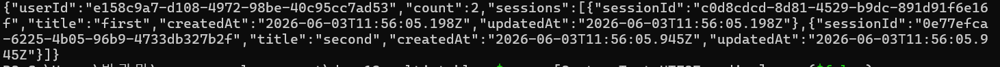
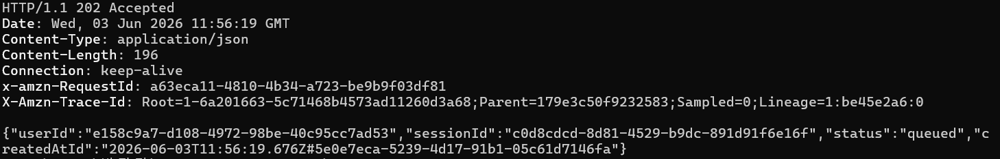
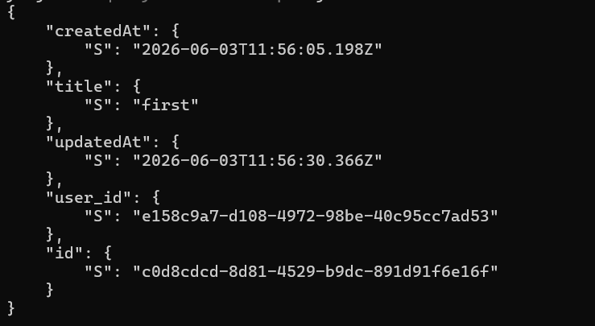
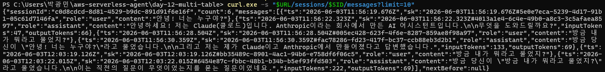
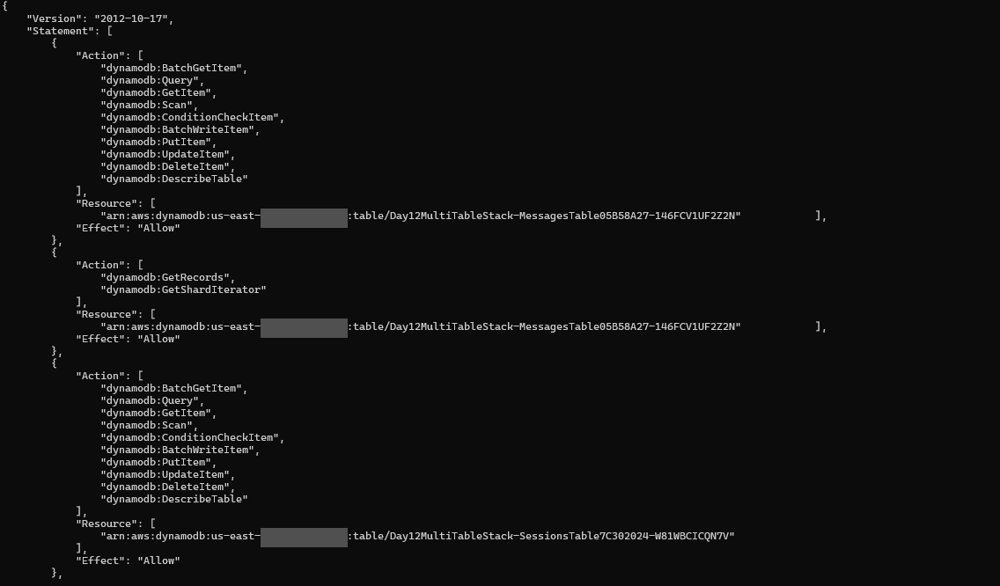
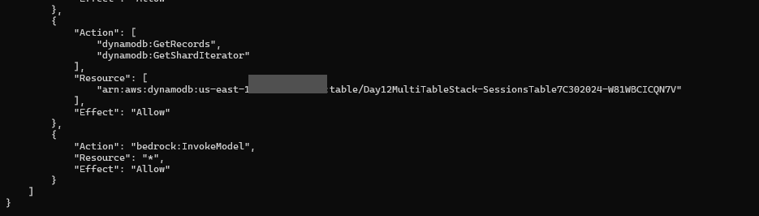

# Day 12: DynamoDB 멀티 테이블 분리 — 단일 → Users / Sessions / Messages

Day 11 까지 모든 데이터를 **단일 `ConversationsTable`(PK `sessionId`, SK `ts`)** 하나에 욱여넣어 왔다. Day 12 는 그걸 원본 [breath103/serverless-agent](https://github.com/breath103/serverless-agent) 의 도메인별 테이블 구조에 맞춰 **Users / Sessions / Messages 3개로 쪼갠다**.

> **규칙: 매일 한 가지만 더하기.** Day 12 는 "테이블 분리" 한 가지. Agent Loop(Day 13), MQTT(Day 14) 는 다음 day 들의 몫. API↔Worker 분리·책임 분리 IAM 은 Day 11 것을 그대로 가져온다.

## 🎯 이 day 가 답하는 것

1. **"왜 단일 테이블로는 부족한가?"** — Day 11 단일 테이블은 `sessionId` 를 알아야만 조회 가능했다. **"이 유저의 세션 목록"** 같은 질의는 `Scan` 외엔 길이 없었다.
2. **도메인별 분리가 어떤 접근 패턴을 새로 여는가** — `SessionsTable` 의 PK 를 `user_id` 로 두면 `GET /users/:userId/sessions` 가 **깨끗한 `Query` 한 번**으로 풀린다.
3. **단일 테이블 vs 멀티 테이블, 원본은 왜 멀티를 택했나** — 아래 트레이드오프 절 참고.

## 🧩 원본과의 매핑

원본 `packages/backend/scripts/lib/backend-stack.ts` 는 도메인별 테이블을 **8개** 둔다. 그중 채팅 MVP 핵심 3개만 차용한다.

| 우리 (Day 12) | 원본 테이블 | PK | SK |
|---|---|---|---|
| `UsersTable` | `${id}-users` | `id` | — |
| `SessionsTable` | `${id}-chat-sessions` | `user_id` | `id` |
| `MessagesTable` | `${id}-chat-messages` | `session_id` | `created_at_id` |

- **`created_at_id`** = 원본이 `created_at` + `id` 를 합성한 정렬 SK. 우리 Day 7/11 의 `makeSk()`(`${iso}#${uuid}`) 와 **완전히 동일한 발상** — 그대로 차용.
- **제외한 5개**: `accounts` / `sessions`(auth 세션, TTL) / `profiles` / `memories` / `user-skills`. auth·agent 전용이라 MVP 범위 밖. auth 는 원본도 로컬 dev 전용이라 도입 안 함.

## 🪜 Day 11 → Day 12 diff

| 측면 | Day 11 | Day 12 |
|---|---|---|
| 테이블 수 | 1개 (`ConversationsTable`) | **3개** (Users / Sessions / Messages) |
| 메시지 키 | PK `sessionId`, SK `ts` | PK `session_id`, SK `created_at_id` |
| 유저 개념 | 없음 | **`UsersTable` + 모든 세션이 유저 소속** |
| `POST /chat` 입력 | `{ sessionId, message }` | `{ userId, sessionId, message }` |
| "유저별 세션 목록" | 불가능 (Scan 필요) | **`GET /users/:userId/sessions` = Query 1번** |
| Worker 역할 | 히스토리+Bedrock+assistant Put | + **세션 `updatedAt` bump** |
| Worker DDB 권한 | 단일 테이블 RW | Messages RW + Sessions RW (Users 안 건드림) |
| API DDB 권한 | 단일 테이블 RW | Users/Sessions/Messages RW |

Day 11 에서 **변하지 않은 것**: API↔Worker 분리, `workerAlias.grantInvoke(api)`, `AGENT_WORKER_FUNCTION_NAME` env, Function URL(BUFFERED), 책임 분리(API 는 Bedrock 모름 / Worker 는 lambda invoke 못 함).

## 🏗️ 아키텍처

```
                       POST /users            ┌───────────────┐
                       POST .../sessions ───▶ │  UsersTable    │ PK id
[curl/브라우저] ──────  GET  .../sessions      └───────────────┘
     │                                        ┌───────────────┐
     │  POST /chat {userId,sessionId,message} │ SessionsTable  │ PK user_id, SK id
     ▼                          ┌────────────▶└───────────────┘  ← "유저의 세션 목록" Query
┌──────────────────┐            │ updatedAt bump      ▲
│  ApiFunction     │────────────┘                     │
│  (Hono, BUFFERED)│                                  │
│  1) user msg Put ─────────────┐                     │
│  2) Worker invoke (Event)     │   ┌───────────────┐ │
│  3) return 202   │            └──▶│ MessagesTable  │ │ PK session_id, SK created_at_id
└──────────────────┘                └───────────────┘ │
     │ async                              ▲            │
     ▼                                    │            │
┌──────────────────┐  Query history       │            │
│  WorkerFunction  │──────────────────────┘            │
│  1) Query N턴    │  Bedrock Converse                  │
│  2) assistant Put ────────────────────────────────────┘ (+ session updatedAt)
└──────────────────┘
```

## 🛣️ 라우트

| 메서드 | 경로 | 동작 | 테이블 |
|---|---|---|---|
| `POST` | `/users` | 유저 생성 `{name?}` → `{id}` | Users (Put) |
| `POST` | `/users/:userId/sessions` | 세션 생성 `{title?}` → `{sessionId}` | Sessions (Put) |
| `GET` | `/users/:userId/sessions` | **유저의 세션 목록** | Sessions (Query) ★ |
| `POST` | `/chat` | `{userId,sessionId,message}` → 202 | Messages (Put) + Worker invoke |
| `GET` | `/sessions/:sessionId/messages` | 세션 메시지 시간순 | Messages (Query) |
| `GET` | `/health` | `{ok:true,day:12,role:"api"}` | — |

## ⚖️ 단일 테이블 vs 멀티 테이블 (honest 트레이드오프)

DynamoDB 커뮤니티의 정설은 **single-table design** (모든 엔티티를 한 테이블에 PK/SK 오버로딩으로 욱여넣기)이다 — 조인 흉내·트랜잭션·핫파티션 분산에 유리. 그런데 **원본은 도메인별 멀티 테이블을 택했다.** 왜?

- **접근 패턴이 테이블 경계와 1:1 로 맞으면 멀티가 더 단순**하다. "유저의 세션 목록"·"세션의 메시지"는 각각 한 테이블의 `Query` 한 번 — GSI·PK 오버로딩 설계를 머리에 들고 있을 필요가 없다.
- **테이블별 독립 설정**: TTL(원본 auth `sessions` 만 `expires_at_epoch`), 용량 모드, 백업, 권한(IAM 을 테이블 단위로 최소화 — Worker 는 Users 를 아예 못 본다).
- **도메인 경계가 코드에서 드러난다**: `MESSAGES_TABLE` vs `SESSIONS_TABLE` 가 곧 책임 분리.
- **대가**: 한 번에 여러 도메인을 원자적으로 쓰려면 `TransactWriteItems` 가 여러 테이블에 걸치고, 크로스 도메인 질의는 앱에서 조합해야 한다. 우리 규모(세션→메시지 단방향)에선 문제 안 됨.

→ **"single-table 가 항상 정답"이 아니라, 접근 패턴이 도메인별로 깔끔하면 멀티가 읽기 쉽다.** 학습 목적상으로도 분리가 경계를 명확히 보여준다.

## 🚀 배포 + 검증 절차

### 1) 배포

```powershell
cd day-12-multi-table
npm install
npx cdk synth        # 합성 에러 먼저 거르기
npm run deploy
# Outputs: ApiUrl, UsersTableName, SessionsTableName, MessagesTableName, WorkerFunctionName 메모
```

### 2) 유저 → 세션 생성 → 세션 목록 (★ 분리가 연 패턴)

```powershell
$URL = "<ApiUrl>"

# 유저 생성
$U = curl.exe -s -X POST "$URL/users" -H "content-type: application/json" -d '{\"name\":\"gwangmin\"}' | ConvertFrom-Json
$UID = $U.id
$UID

# 세션 2개 생성
$S1 = curl.exe -s -X POST "$URL/users/$UID/sessions" -H "content-type: application/json" -d '{\"title\":\"first\"}' | ConvertFrom-Json
$S2 = curl.exe -s -X POST "$URL/users/$UID/sessions" -H "content-type: application/json" -d '{\"title\":\"second\"}' | ConvertFrom-Json
$SID = $S1.sessionId

# 유저의 세션 목록 — Day 11 에선 불가능했던 Query
curl.exe -s "$URL/users/$UID/sessions"
# 기대: { userId, count:2, sessions:[{sessionId,title,...}, ...] }
```

### 3) 채팅 → 멀티턴 누적 확인 (Day 11 과 동일 검증)

```powershell
$enc = [System.Text.UTF8Encoding]::new($false)
[System.IO.Directory]::SetCurrentDirectory((Get-Location).Path)

function Send-Chat($msg) {
  $p = @{ userId=$UID; sessionId=$SID; message=$msg } | ConvertTo-Json -Compress
  [System.IO.File]::WriteAllBytes("payload.json", $enc.GetBytes($p))
  curl.exe -s -i -X POST "$URL/chat" -H "content-type: application/json" --data-binary "@payload.json"
}

Send-Chat "안녕! 너는 누구야?"      # → HTTP 202
Start-Sleep -Seconds 8
Send-Chat "방금 내가 뭐라고 물었지?"  # → HTTP 202 (직전 맥락 참조)
Start-Sleep -Seconds 8

curl.exe -s "$URL/sessions/$SID/messages?limit=10"
# 기대: count:4 (user+assistant ×2), 2번째 assistant 의 inputTokens 가 1번째보다 큼 = 멀티턴 누적 증거
```

### 4) 세션 updatedAt bump 확인

```powershell
$SESS = "<SessionsTableName>"
aws dynamodb get-item --table-name $SESS `
  --key "{\"user_id\":{\"S\":\"$UID\"},\"id\":{\"S\":\"$SID\"}}" `
  --query "Item.updatedAt.S"
# 기대: createdAt 보다 나중 시각 (Worker 가 assistant Put 후 bump)
```

### 5) 정리

```powershell
npx cdk destroy --force
```

## 📸 실배포 검증 결과 (2026-06-03)

직접 us-east-1 에 배포 후 검증. 6컷이 각각 다른 주장을 증명한다.

### #1 — 분리가 연 새 패턴: "유저별 세션 목록" Query



유저 생성 → 세션 2개 생성 후 `GET /users/:userId/sessions` → `count:2`. **Day 11 단일 테이블에선 `sessionId` 를 모르면 Scan 외엔 불가능했던 질의**가 `SessionsTable.Query(user_id)` 한 번으로 풀린다. PK 를 `user_id` 로 둔 결과.

### #2 — API 는 즉시 응답 (`/chat` → HTTP 202)



`{ userId, sessionId, message }` POST 가 `202 Accepted` + `{status:"queued", createdAtId:...}` 즉시 응답. Bedrock 대기 안 함 — Worker 는 `InvocationType:Event` 로 fire-and-forget (Day 11 패턴 유지).

### #3 — Worker 가 분리된 Sessions 테이블 메타를 bump



`get-item` 결과 `createdAt: 11:56:05.198Z` → **`updatedAt: 11:56:30.366Z`**. Worker 가 assistant 메시지를 MessagesTable 에 Put 한 뒤 SessionsTable 의 해당 세션(`user_id`+`id`) `updatedAt` 을 `UpdateCommand` 로 갱신했다는 증거. **분리된 두 테이블에 걸친 쓰기가 정확히 동작.**

### #4 — 멀티턴 컨텍스트 누적 (`inputTokens` 가 증거)



같은 세션 3턴 후 `GET /sessions/:id/messages` → `count:6` (user+assistant ×3) 시간순. **결정적 숫자: `inputTokens` 47 → 133 → 222 단조 증가** = 턴마다 직전 user+assistant 가 MessagesTable 에서 Query 되어 Bedrock messages 배열에 누적됨. assistant 가 직전 질문을 실제로 기억해 답함. **단일 → 멀티 테이블로 쪼갰어도 대화 누적 데이터-패스가 그대로 작동.**

### #5/#6 — Worker IAM: 테이블 단위 최소권한




`aws iam get-role-policy` (Worker role) 결과:
- ✅ `dynamodb:Query/PutItem/UpdateItem/...` on **MessagesTable + SessionsTable ARN 만**
- ❌ **UsersTable ARN 한 줄도 없음** → Worker 는 UsersTable 을 정책 차원에서 못 본다
- ✅ `bedrock:InvokeModel` on `*` (모델 호출 전담)
- ❌ `lambda:InvokeFunction` 없음 → 다른 람다 못 부름 (Day 11 제약 유지)

→ **테이블 분리가 IAM 최소권한을 도메인 단위로 강제**. API 는 반대로 Users/Sessions/Messages 3테이블 RW + workerAlias invoke 를 갖되 Bedrock 권한은 없음.

> Account ID 는 가렸지만 ARN 의 의미 정보(region/table)는 남김. 공개 레포 관행으로 마스킹.

### 측정치 요약

| 항목 | 값 | 출처 |
|---|---|---|
| 유저 세션 목록 | `count:2` | `GET /users/:id/sessions` |
| `/chat` 응답 | HTTP 202 `{status:"queued"}` | curl `-i` |
| 세션 createdAt → updatedAt | `11:56:05.198Z` → `11:56:30.366Z` | `get-item` |
| 멀티턴 메시지 수 | `count:6` (3턴) | `GET .../messages` |
| inputTokens 누적 | **47 → 133 → 222** | 응답 body — 멀티턴 증거 |
| Worker IAM 테이블 | Messages + Sessions (Users 제외) | `get-role-policy` |

## ⚠️ 함정 / 트러블슈팅 (Day 12 발견분)

| # | 함정 | 원인 | 회피 |
|---|---|---|---|
| 17 | 세션 단건을 `sessionId` 만으로 못 집음 | `SessionsTable` PK 가 `user_id`(원본 그대로) | 세션을 다루는 모든 경로에 `userId` 동반 — `/chat`·Worker payload 에 `userId` 포함 |
| 18 | Worker 가 세션 `updatedAt` 갱신하려다 실패 | bump 대상 세션 메타행이 아직 없음(/chat 만 호출, 세션 미생성) | `ConditionExpression: attribute_exists(user_id)` + try/catch — bump 실패는 warn 만, assistant Put 은 이미 성공 |
| 19 | 메시지 키 이름 바꾸고 `before` 커서가 깨짐 | `ts`/`sk` → `session_id`/`created_at_id` 로 컬럼명 변경됨 | `nextBefore` 도 `created_at_id` 값으로 통일, `tsOf()` 는 `created_at_id` 에서 추출 |
| 20 | Worker IAM 에 Users 권한을 습관적으로 부여 | Day 11 복붙 | Worker 는 Messages+Sessions 만 RW. Users 는 API 전담 — 최소권한 |

> 함정 1~16 은 Phase 2 회고 / Day 11 README 에 정리. Day 12 부터 17~ 누적.

## 🧠 남긴 숙제 → 다음 day 들로

| 숙제 | 어디서 |
|---|---|
| Worker 안 Agent Loop (`toolUse` 반복), timeout 60s→5min | Day 13 |
| Worker 출력이 어디로도 안 흐름 → IoT MQTT `sessions/${id}/events` publish | Day 14 |
| 폴링 → 실시간 push (mqtt.js + SigV4 WSS) | Day 15 |
| 세션 목록을 updatedAt 시간순으로 (현재 SK=id 정렬) → GSI 또는 `updated_at#id` SK | 후속 |

## 🎁 Day 12 가 남긴 자산

- **도메인별 테이블 + 키 스키마(원본 미러)** — Day 13~ 에서 memories/skills 테이블 추가 시 같은 패턴
- **`user_id` PK 로 "소유자별 목록" Query** — 원본 chat-sessions 패턴, 다른 per-user 리소스에 재사용
- **테이블 단위 최소권한 IAM** — Worker 가 Users 를 못 보는 것이 정책으로 강제
