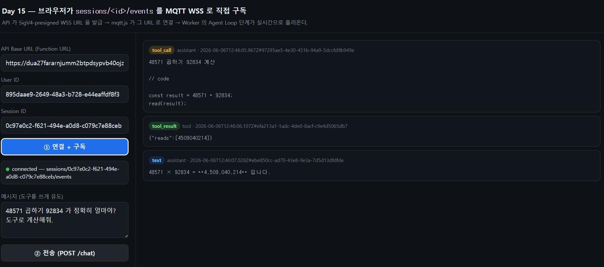
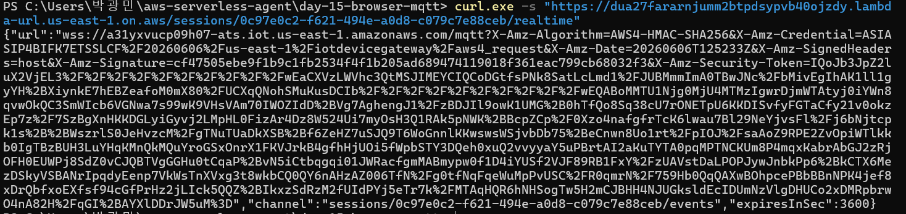
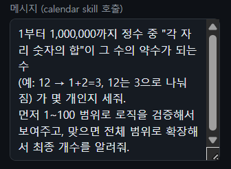
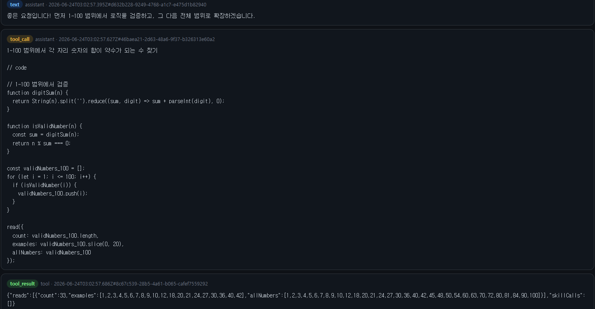
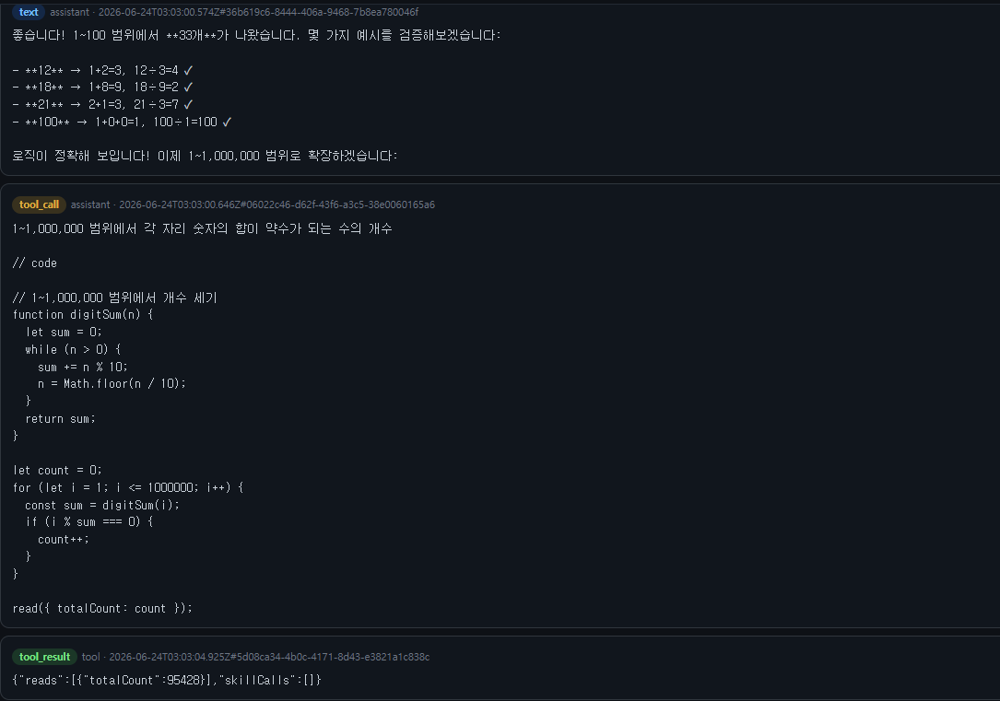
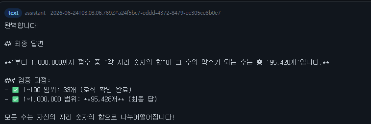

# Day 15: 브라우저가 MQTT 를 직접 구독 (SigV4 WSS)

Day 14 는 Worker 가 `sessions/${id}/events` 토픽에 단계를 쏘게 만들었고, 확인은 **AWS 콘솔 MQTT test client** 로 했다. Day 15 는 그걸 **브라우저**가 직접 본다. 브라우저엔 AWS 자격증명이 없으니, **API 가 그 세션 토픽만 구독 가능한 SigV4-presigned WSS URL 을 발급**해 내려주고, 브라우저는 `mqtt.js` 로 그 URL 에 붙어 구독한다. X.509 인증서 없이 **IAM 자격증명만으로** IoT Core 에 WebSocket 연결하는 정공법.

> **규칙: 매일 한 가지만 더하기.** Day 15 는 "브라우저가 MQTT 를 직접 구독" 한 가지. Worker·테이블·Function URL 은 Day 14 그대로. 브라우저 페이지 **호스팅**(S3/CloudFront/Lambda@Edge)은 Day 16 몫 — 여기선 정적 페이지를 **localhost** 로 띄워 검증한다.

## 🎯 이 day 가 답하는 것

1. **키 없는 브라우저가 어떻게 IoT 에 붙나** — 서버(API)가 SigV4 로 **미리 서명한 `wss://...-ats.iot.../mqtt?...` URL** 을 만들어 준다. 브라우저는 그 URL 로 그냥 `mqtt.connect()` 하면 끝. 서명에 권한이 박혀 있어 추가 인증 핸드셰이크가 없다.
2. **브라우저가 받는 권한을 어떻게 한 세션으로 좁히나** — API 가 `RealtimeRole` 을 **AssumeRole** 하되, `Policy`(세션정책)로 `iot:Subscribe/Receive` 를 **이 sessionId 토픽 하나**로 더 좁힌다. URL 이 새도 그 세션만 구독 가능(publish 불가, 다른 세션 불가).
3. **WSS 호스트는 어디서 오나** — `iot:DescribeEndpoint(iot:Data-ATS)` — Day 14 의 publish 와 **같은 ATS 엔드포인트**(https 는 publish, wss 는 구독).
4. **브라우저는 무엇을 렌더하나** — 토픽으로 흐르는 `entity_update` 이벤트의 `row.kind`(text/tool_call/tool_result) — `GET /messages` 와 **같은 모양**이라 렌더 코드를 공유.

## 🧩 원본과의 매핑

| 우리 | 원본 (`packages/`) | 하는 일 |
|---|---|---|
| `api.mjs` `signIotWebSocketUrl` | `backend/src/lib/iot-sigv4.ts` | SigV4 로 WSS URL 서명 (그대로 포팅) |
| `api.mjs` `GET /sessions/:id/realtime` | `backend/src/lambda-api/routes/realtime.ts` `/api/realtime/connection` | `{ url, channel }` 발급 |
| `api.mjs` `scopedSessionCredentials` | `backend/src/lambda-api/routes/realtime.ts` `scopedIotCredentialsFor` | AssumeRole + 세션정책 스코핑 |
| `web/index.html` | `frontend/src/lib/realtime/client.ts` | `mqtt.connect` → `subscribe` → 렌더 |

**바꾼 것**: 유저별 토픽 → **세션별**(`sessions/${id}/events`), `superjson` → **`JSON`**, broker URL env → **`DescribeEndpoint` 런타임 조회**, Vite/React 프론트 → **단일 정적 HTML + esm.sh 의 mqtt.js**(빌드 0). RxJS 재연결 로직은 들어냄(데모는 단발 연결).

## 🔁 흐름

```
브라우저 ── GET /sessions/<id>/realtime ─────────▶ API Lambda
   ▲                                                  │ 1) STS AssumeRole(RealtimeRole, Policy=이 세션 토픽만)
   │  { url:"wss://...-ats.iot.../mqtt?X-Amz-...",    │ 2) DescribeEndpoint(Data-ATS) → host
   │    channel:"sessions/<id>/events" }              │ 3) signIotWebSocketUrl(host,region,creds)
   │◀─────────────────────────────────────────────────┘
   │
   └─ mqtt.connect(url) → subscribe(channel, qos1) ──▶ IoT Core ── 이벤트 ──▶ 화면 렌더
                                                          ▲
                       POST /chat ─▶ Worker(Agent Loop) ──┘  putRow 마다 publish (Day 14)
```

## 🔑 SigV4 WSS 서명 — IoT 특유의 함정

```js
// service = iotdevicegateway, path = /mqtt.  보안토큰은 서명에서 빼고 URL 끝에 붙인다(IoT 만 이렇게).
const canonicalRequest = ["GET","/mqtt", canonicalQuery, `host:${host}\n`, "host", sha256hex("")].join("\n");
// ... 서명 계산 ...
let url = `wss://${host}/mqtt?${canonicalQuery}&X-Amz-Signature=${signature}`;
if (creds.sessionToken) url += `&X-Amz-Security-Token=${encodeURIComponent(creds.sessionToken)}`;  // ★ 서명 후 추가
```

## 🛡️ 브라우저가 받는 권한 = 두 정책의 교집합

| 계층 | 허용 | 어디 |
|---|---|---|
| `RealtimeRole` 자체 | `iot:Connect/Subscribe/Receive` on `sessions/*/events` | CDK (상한선) |
| AssumeRole `Policy`(세션정책) | 같은 액션 on `sessions/<이 id>/events` | `api.mjs` 런타임 (좁히기) |
| **브라우저 실제 권한** | **이 세션 토픽 구독만** (교집합) | — |

publish 권한은 어디에도 없음 → 브라우저는 **듣기 전용**.

## 🪜 Day 14 → Day 15 diff

| 측면 | Day 14 | Day 15 |
|---|---|---|
| 이벤트 소비자 | AWS 콘솔 MQTT test client | **브라우저 (`web/index.html`)** |
| API 라우트 | (변화 없음) | **+ `GET /sessions/:id/realtime`** |
| API IAM | DDB + lambda invoke | **+ `sts:AssumeRole` + `iot:DescribeEndpoint`** |
| 새 IAM Role | — | **`RealtimeRole`** (API 가 assume, 세션정책으로 스코핑) |
| API SDK | dynamodb/lib/lambda | **+ client-iot / client-sts** (external) |
| 브라우저 코드 | — | **mqtt.js (esm.sh) WSS 구독 + 렌더** |
| Worker | — | **그대로** (Day 14 publish 불변) |

**안 변한 것**: Worker(Agent Loop + publish), 테이블 3개, Function URL(BUFFERED), API↔Worker 분리, API 는 Bedrock 권한 없음.

## 🏗️ 아키텍처

```
[브라우저] ── GET /…/realtime ──▶ ApiFunction ──(AssumeRole+세션정책)──▶ RealtimeRole
     │                               │  └─ DescribeEndpoint, signIotWebSocketUrl
     │◀──── { url, channel } ────────┘
     │
     ├─ mqtt WSS subscribe ─────────────────────────────▶ IoT Core
     │                                                       ▲
     └─ POST /chat ─▶ ApiFunction ─invoke(Event)▶ WorkerFunction ─publish(qos1)┘
```

## 🚀 배포 + 검증 절차

### 1) 배포

```powershell
cd day-15-browser-mqtt
npm install
npx cdk synth
npm run deploy
# Outputs: ApiUrl 메모 (RealtimeConnectionUrl, RealtimeRoleArn 도 찍힘)
```

### 2) 유저 / 세션 생성 (Day 12~14 동일)

```powershell
$URL = "<ApiUrl, 끝 슬래시 빼고>"
$U  = curl.exe -s -X POST "$URL/users" -H "content-type: application/json" -d '{\"name\":\"gwangmin\"}' | ConvertFrom-Json
$UID = $U.id
$S  = curl.exe -s -X POST "$URL/users/$UID/sessions" -H "content-type: application/json" -d '{\"title\":\"browser\"}' | ConvertFrom-Json
$SID = $S.sessionId
"UID=$UID"; "SID=$SID"
```

### 3) connection 엔드포인트가 WSS URL 을 주는지 (서버 측 먼저 확인)

```powershell
curl.exe -s "$URL/sessions/$SID/realtime"
# 기대: {"url":"wss://xxxx-ats.iot.us-east-1.amazonaws.com/mqtt?X-Amz-Algorithm=...","channel":"sessions/<SID>/events","expiresInSec":3600}
```

### 4) 브라우저 페이지를 localhost 로 띄우고 구독

```powershell
cd web
python3 -m http.server 5173      # 또는: npx serve .
# 브라우저에서 http://localhost:5173 열기
```

페이지에서:
1. **API Base URL** = `$URL`, **User ID** = `$UID`, **Session ID** = `$SID` 입력
   (또는 주소창에 `http://localhost:5173/?api=...&user=...&session=...` 로 프리필)
2. **① 연결 + 구독** → 상태가 `connected — sessions/<SID>/events` (초록) 가 되면 WSS 구독 성공
3. **② 전송 (POST /chat)** → 잠시 뒤 `tool_call` → `tool_result` → `text` 카드가 **폴링 없이** 실시간으로 쌓임

> ⚠️ MQTT 는 retained 가 아니다 — **반드시 ② 전에 ①(구독)** 을 끝내야 그 턴의 이벤트를 받는다.

### 5) 정리

```powershell
npx cdk destroy --force
```

## 🔍 실배포 검증 결과

us-east-1 에 배포 후, 브라우저(localhost) 페이지가 **AWS 콘솔 없이** Worker 의 Agent Loop 단계를
실시간으로 받아냈다.



**① 연결 + 구독** → 상태가 `connected — sessions/0c97e0c2-…/events`(초록) 로 바뀌어 WSS 구독 성공.
**② 전송** 직후, **폴링 없이** 카드가 순서대로 쌓였다 —
`tool_call`(`const result = 48571 * 92834; read(result)`) → `tool_result`(`{"reads":[4509040214]}`)
→ `text`(`4,509,040,214 입니다`). Day 14 의 publish 가 브라우저까지 그대로 도달한 것.



서버 측 `GET /sessions/:id/realtime` 은 `wss://…-ats.iot.us-east-1.amazonaws.com/mqtt?X-Amz-Algorithm=…
&X-Amz-Credential=ASIA…&X-Amz-Signature=…&X-Amz-Security-Token=…` 형태의 **SigV4-presigned URL** +
`channel: sessions/<id>/events` 를 돌려준다. `ASIA…` 키는 AssumeRole 로 발급된 **1시간 단명** 임시
자격증명이라 노출돼도 그 세션 구독 외엔 아무것도 못 한다(스코핑의 핵심).

| 측정치 | 값 |
|---|---|
| 연결 방식 | 브라우저 `mqtt.connect(wss URL)` (X.509 인증서 없음, IAM 서명만) |
| channel | `sessions/<sessionId>/events` |
| 한 턴 수신 이벤트 | 3 (tool_call / tool_result / text) |
| 자격증명 | STS AssumeRole + 세션정책, `expiresInSec: 3600` |
| 호스팅 | 정적 페이지 localhost (S3/CloudFront 는 Day 16) |

#### Agent Loop tool-call 시퀀스

브라우저가 실시간으로 받은 Agent Loop 진행 — `tool_call` / `tool_result` / `text` 카드가 폴링 없이 순서대로 쌓인다.

<table>
  <tr>
    <td width="50%"></td>
    <td width="50%"></td>
  </tr>
  <tr>
    <td width="50%"></td>
    <td width="50%"></td>
  </tr>
</table>

## ⚠️ 함정 / 트러블슈팅 (Day 15 발견분)

| # | 함정 | 원인 | 회피 |
|---|---|---|---|
| 32 | WSS 연결이 서명 불일치로 거부 | `X-Amz-Security-Token` 을 canonical query(서명 대상)에 넣음 | 토큰은 **서명 계산에서 빼고** URL 끝에만 붙인다(IoT 특유) |
| 33 | SignatureDoesNotMatch | 서비스명/경로 오타 | service=`iotdevicegateway`, path=`/mqtt`, signed header=`host` |
| 34 | 브라우저에 과한 권한 | Lambda 자기 키를 그대로 서명에 사용 | `AssumeRole` + **세션정책**으로 그 세션 토픽·1h 로 한정 |
| 35 | CDK 순환 의존(Role↔Lambda) | env 에 roleArn 넣고 trust 에 functionRole 넣으면 서로 참조 | env 는 `apiFn.addEnvironment` 로 **함수 생성 후** 주입, trust 는 `ArnPrincipal(apiFn.role.roleArn)` |
| 36 | 브라우저가 connect 후 바로 끊김 | mqtt.js protocolVersion 미지정/5 | IoT 는 MQTT 3.1.1 → **`protocolVersion: 4`** |
| 37 | 구독은 되는데 이벤트가 안 옴 | API `MQTT_TOPIC_PREFIX` ≠ Worker 값 → channel 이 publish 토픽과 불일치 | 둘 다 `sessions` 로 동일하게 |
| 38 | 첫 턴 이벤트를 놓침 | retained 아님 — 구독 전 publish 분은 안 옴 | **구독 먼저, chat 나중** |


## 🧠 남긴 숙제 → 다음 day 들로

| 숙제 | 어디서 |
|---|---|
| 정적 페이지 호스팅 — S3/CloudFront + Lambda@Edge 로 `/api/*` 라우팅 + SSM 캐싱 | Day 16 |
| 끊김/만료(1h) 시 재연결 + 새 URL 재발급 (원본 RxJS 백오프) | 옵션 |
| user 메시지도 토픽에 흘려 화면에 내 말풍선까지 (지금은 Worker 단계만) | 옵션 |

## 🎁 Day 15 가 남긴 자산

- **SigV4-presigned WSS URL 발급 패턴** — 키 없는 클라이언트를 IAM 만으로 IoT 에 붙이는 정공법
- **AssumeRole + 세션정책 스코핑** — 클라이언트마다 "딱 그 토픽만" 단명 권한
- **빌드 없는 브라우저 MQTT 구독** — esm.sh 의 mqtt.js 한 줄로 실시간 수신, `GET /messages` 와 렌더 공유
