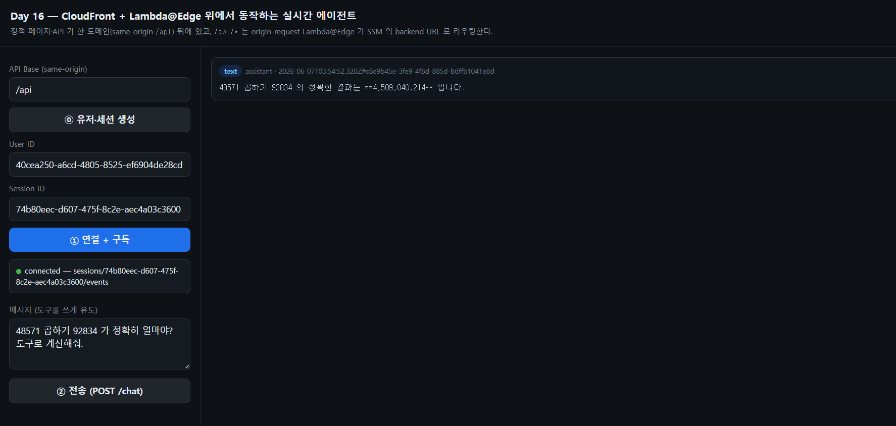
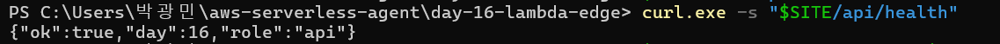

# Day 16: Lambda@Edge + SSM — CDN 뒤에서 도는 에이전트

Day 15 까지 브라우저 페이지는 **localhost** 로만 띄웠고, API 는 별도 Function URL 을 직접 쳤다. Day 16 은 그걸 **CloudFront + S3** 한 도메인 뒤로 합친다(same-origin `/api`). 그리고 Day 9 가 `/api` 접두어를 떼던 **CloudFront Function 을 origin-request Lambda@Edge 로 업그레이드**한다 — 백엔드 host 를 distribution 에 굽는 대신 **SSM Parameter Store 에 두고 엣지가 런타임에 조회**한다.

> **규칙: 매일 한 가지만 더하기.** Day 16 은 "엣지가 SSM 으로 백엔드를 찾아 라우팅" 한 가지. 백엔드(API+Worker+IoT+realtime)는 Day 15 그대로 얹기만 한다.

## 🎯 이 day 가 답하는 것

1. **왜 host 를 SSM 에 두나** — Day 9 는 backend host 를 deploy-time 값으로 distribution 에 **구웠다**. 그러면 백엔드 URL 이 바뀔 때마다 CloudFront 를 다시 배포해야 한다. SSM 에 두면 엣지가 cold start 때 읽어(60s 캐시) origin 을 동적으로 정한다 → **백엔드와 CDN 디커플링**.
2. **CloudFront Function vs Lambda@Edge** — Day 9 의 CF Function 은 URI 문자열만 만질 수 있었다(µs, 무료). Lambda@Edge 는 **`request.origin` 자체를 바꾸고 SSM·DDB 같은 AWS 호출**을 할 수 있다(ms, Node 런타임). origin 을 런타임에 고르려면 Lambda@Edge 가 필요하다.
3. **Lambda@Edge 의 제약을 어떻게 사나** — ① us-east-1 필수 ② **환경변수 금지** → 설정값은 소스 상수 ③ NodejsFunction 기본 env 도 끔(`awsSdkConnectionReuse:false`).
4. **same-origin 의 이득** — 브라우저는 `/api/...` 만 친다 → CORS 사라짐, HTTPS 기본, 한 도메인. (실시간 WSS 는 여전히 IoT 로 직접 — CDN 우회.)

## 🧩 원본과의 매핑

| 우리 | 원본 (`packages/`) | 하는 일 |
|---|---|---|
| `lambda/edge-origin-request.mjs` | `edge/src/origin-request/index.ts` | SSM 에서 backend URL 조회 → `request.origin` 교체 |
| `BACKEND_URL_PARAM` = `/serverless-agent/backend/url` | `shared/src/ssm-parameters.ts` `backendUrlName` | 파라미터 이름 규칙 |
| `EdgeRole`(lambda+edgelambda) + `ssm:GetParameter` | edge-stack 의 엣지 role | 엣지 함수 권한 |

**바꾼/들어낸 것**:
- 원본은 edge 가 **별도 스택/배포** → SSM 이 backend 와의 유일한 연결고리. 우리는 한 스택이지만 **같은 SSM 패턴**을 써서 디커플링을 그대로 보여준다.
- 원본 `viewer-request` 의 서브도메인·멀티브랜치 라우팅은 우리 범위 밖 → 생략.
- 원본은 `/api` 를 **안 뗀다**(백엔드 라우트가 `/api/...`). 우리 Hono 는 `/chat` 라 **엣지에서 `/api` strip**(Day 9 의 일을 엣지로 이관).
- 설정 주입: 원본은 esbuild `define` → 우리는 **소스 상수**(Windows esbuild define 따옴표 버그 + 엣지 env 불가).

## 🔁 요청 흐름

```
브라우저
  │  GET /            ─▶ CloudFront(default) ─▶ S3 (index.html)            [정적]
  │  POST /api/chat   ─▶ CloudFront(api/*) ─▶ origin-request Lambda@Edge:
  │                         1) SSM GetParameter(/serverless-agent/backend/url)  (60s 캐시)
  │                         2) request.origin.custom.domainName = backend host
  │                         3) request.headers.host = backend host
  │                         4) uri "/api/chat" → "/chat"   (strip)
  │                       ─▶ Lambda Function URL (Hono) ─▶ Worker ...        [API]
  │  GET /api/sessions/:id/realtime ─▶ (위와 동일) ─▶ { wss URL, channel }
  └─ mqtt.connect(wss URL) ───────────────────────────▶ IoT Core            [실시간, CDN 우회]
```

## 🧱 origin-request Lambda@Edge 핵심

```js
const PROJECT = "serverless-agent";   // 엣지는 env 불가 → 상수
const SSM_REGION = "us-east-1";

let cached = null;                     // 엣지 인스턴스 살아있는 동안 60s 재사용
async function getBackendUrl() {
  if (cached && cached.expires > Date.now()) return cached.value;
  const out = await ssm.send(new GetParameterCommand({ Name: `/${PROJECT}/backend/url` }));
  cached = { value: out.Parameter?.Value ?? null, expires: Date.now() + 60_000 };
  return cached.value;
}

export const handler = async (event) => {
  const request = event.Records[0].cf.request;
  if (request.uri === "/api" || request.uri.startsWith("/api/")) {
    const host = new URL(await getBackendUrl()).hostname;
    request.origin = { custom: { domainName: host, port: 443, protocol: "https", /* ... */ } };
    request.headers.host = [{ key: "Host", value: host }];
    request.uri = request.uri === "/api" || request.uri === "/api/" ? "/" : request.uri.slice(4);
  } else if (!(request.uri.split("/").pop() || "").includes(".")) {
    request.uri = "/index.html";       // SPA fallback
  }
  return request;
};
```

## 🪜 Day 9 → Day 16 diff

| 측면 | Day 9 | Day 16 |
|---|---|---|
| `/api` strip | CloudFront **Function** (viewer-request) | **Lambda@Edge** (origin-request) |
| backend host | distribution 에 **구움** (deploy-time prop) | **SSM Parameter** 런타임 조회(60s 캐시) |
| origin 선택 | 정적(behavior 고정) | 엣지가 `request.origin` **동적 교체** |
| 백엔드 URL 변경 시 | CF 재배포 | **CF 그대로** (엣지가 60초 내 반영) |
| 프론트 | Vite 빌드 산출물 | Day 15 단일 정적 HTML (빌드 없음, same-origin `/api`) |
| 백엔드 | Day 7 단일 Lambda | Day 15 전체 (API+Worker+IoT+realtime) |

## 🏗️ 아키텍처

```
                         ┌──────────── CloudFront ────────────┐
[브라우저] ──https──▶     │ default → S3(OAC, private)          │
                         │ api/*  → origin-request Lambda@Edge │──SSM──▶ /serverless-agent/backend/url
                         └─────────────────────┬───────────────┘            │ (= API Function URL)
                                               ▼ origin 교체                  ▼
                                   Lambda Function URL (API) ─▶ Worker ─▶ Bedrock/DDB/IoT
```

## 🚀 배포 + 검증 절차

### 1) 배포 (CloudFront + Lambda@Edge 라 5~15분 + 전파)

```powershell
cd day-16-lambda-edge
npm install
npx cdk synth
npm run deploy
# Outputs: SiteUrl(=https://xxxx.cloudfront.net), BackendUrlParamName
```

### 2) SSM 에 backend URL 이 들어갔는지 (엣지가 읽을 값)

```powershell
aws ssm get-parameter --name "/serverless-agent/backend/url" --query "Parameter.Value" --output text --region us-east-1
# → https://xxxx.lambda-url.us-east-1.on.aws/
```

### 3) same-origin /api 가 엣지를 타고 백엔드에 닿는지

```powershell
$SITE = "<SiteUrl>"
curl.exe -s "$SITE/api/health"     # {"ok":true,"day":16,"role":"api"} 나오면 엣지 라우팅 성공
```

> 배포 직후 몇 분은 503/404 가 날 수 있다(엣지 복제 전파 대기). 잠시 후 재시도.

### 4) 브라우저로 끝까지 (호스팅된 페이지에서)

1. 브라우저로 **`$SITE`** 접속 (이제 localhost 아님 — CloudFront).
2. **⓪ 유저·세션 생성** → User/Session ID 자동 채움 (`/api/users` 가 엣지를 탐)
3. **① 연결 + 구독** → `connected`(초록)
4. **② 전송** → `tool_call` → `tool_result` → `text` 실시간

### 5) 정리

```powershell
npx cdk destroy --force
```

> ⚠️ Lambda@Edge 는 엣지 복제본 때문에 **즉시 삭제가 안 될 수 있다**(`Lambda function ... replicated` 오류). CloudFront 분배가 내려간 뒤 수십 분~수시간 후 자동 정리되거나, 시간 두고 `destroy` 재시도.

## 🔍 실배포 검증 결과

us-east-1 에 배포 후, **localhost 가 아닌 CloudFront 도메인**에서 페이지가 same-origin `/api` 로
끝까지 동작했다.



호스팅된 페이지에서 **⓪ 유저·세션 생성**(→ `/api/users` 가 엣지를 타고 백엔드 생성) → **① 연결+구독**
(`connected — sessions/74b80eec-…/events`, 초록) → **② 전송** → assistant 가 도구 결과
`4,509,040,214` 를 실시간 카드로 렌더. 정적 페이지·API·실시간이 **한 도메인 뒤**에서 맞물려 돈다.



`curl $SITE/api/health` → `{"ok":true,"day":16,"role":"api"}`. CloudFront `api/*` →
origin-request Lambda@Edge(SSM 조회 + `/api` strip → `/health`) → Function URL 까지의 경로가
실제로 연결됨을 확인. (`/api` 가 백엔드엔 없는데도 200 = 엣지가 strip 한 증거.)

| 측정치 | 값 |
|---|---|
| 진입점 | `https://<id>.cloudfront.net` (단일 도메인, CORS 없음) |
| API 라우팅 | `api/*` → origin-request Lambda@Edge → SSM(`/serverless-agent/backend/url`) → Function URL |
| `/api` strip | 엣지에서 제거 (`/api/health` → `/health`, 200) |
| 실시간 | 브라우저 → IoT WSS 직접 (CDN 우회), 세션 토픽 구독 |
| backend host 출처 | distribution 에 안 구움 — **SSM 런타임 조회**(60s 캐시) |

## ⚠️ 함정 / 트러블슈팅 (Day 16 발견분)

| # | 함정 | 원인 | 회피 |
|---|---|---|---|
| 39 | 배포 시 "Lambda@Edge does not support environment variables" | NodejsFunction 이 기본으로 `AWS_NODEJS_CONNECTION_REUSE_ENABLED` env 주입 | `awsSdkConnectionReuse: false` + 설정값은 **소스 상수** |
| 40 | esbuild `Invalid define value` (Windows) | `--define:process.env.X="v"` 의 안쪽 따옴표가 깨져 `=v` 로 전달 | define 안 쓰고 **상수 하드코딩** (엣지는 어차피 빌드타임 고정) |
| 41 | `new URL(functionUrl)` synth 에러 | 같은 스택의 Function URL 은 **토큰** — synth 시 파싱 불가 | `Fn.select(2, Fn.split('/', url))` 로 host 추출(deploy-time 해석) |
| 42 | 엣지 연결이 거부/생성 실패 | Lambda@Edge 는 **us-east-1** 필수 | `bin` 에서 `region: 'us-east-1'` 고정 |
| 43 | origin 교체 후 백엔드가 403/SNI 에러 | Function URL 은 **자기 도메인 Host** 만 받음 | 엣지가 `request.headers.host = backend host` 로 세팅 |
| 44 | 엣지에서 SSM 403 / 빈 값 | Role 에 `ssm:GetParameter` 없음 / 코드의 `SSM_REGION` 불일치 | EdgeRole 에 권한 + `SSM_REGION='us-east-1'` = 파라미터 리전 |
| 45 | `/api/chat` 이 백엔드에서 404 | 우리 Hono 엔 `/api` 라우트 없음 | 엣지에서 `/api` **strip** (원본은 안 뗌 — 백엔드가 `/api/*`) |
| 46 | `destroy` 가 엣지 함수 삭제 실패 | 엣지 복제본이 아직 남음 | 정상 — CF 내려간 뒤 시간 두고 재시도 |

> 함정 1~20 Phase 2/Day 11~12, 21~26 Day 13, 27~31 Day 14, 32~38 Day 15. Day 16 부터 39~ 누적.

## 🧠 남긴 숙제 → 다음 day 들로

| 숙제 | 어디서 |
|---|---|
| 커스텀 도메인 + ACM 인증서 (cloudfront.net → 내 도메인) | 옵션 |
| 엣지가 SSM 대신 DDB/config 로 멀티백엔드(blue-green) 라우팅 | 옵션 |
| 회고 + 비용/보안 강화 (Telegram/Discord 등 채널 연동) | Day 17+ |

## 🎁 Day 16 이 남긴 자산

- **origin-request Lambda@Edge 로 origin 동적 라우팅** — host 를 SSM 에서 읽어 백엔드/CDN 디커플링
- **same-origin `/api` 통합** — CORS 제거, 한 도메인 HTTPS, 정적+API 한 CDN 뒤
- **Lambda@Edge 운영 제약 체득** — us-east-1·무환경변수·복제 삭제 지연까지 실배포로 확인
