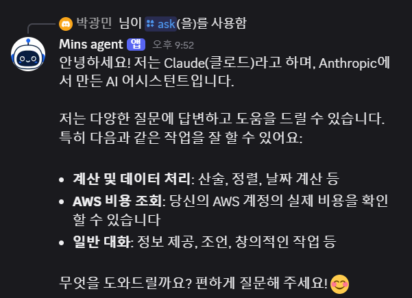
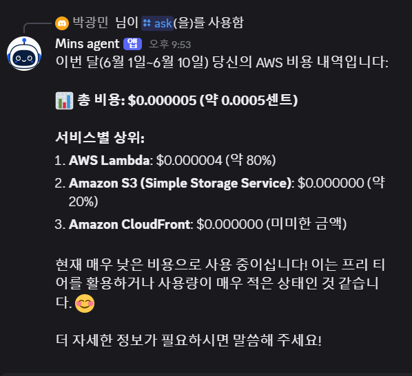

# Day 18: 디스코드 봇 — 채널에서 말 걸면 에이전트가 답

원본은 채널 통합으로 **Telegram**(`channels/telegram-dispatcher.ts`)을 쓴다. Day 18 은 그 자리를 **Discord** 로 바꾼다(원본에서 갈라지는 첫 채널). 디스코드에서 `/ask 메시지` 를 치면 → Discord 가 우리 **Interactions 엔드포인트**로 POST → 기존 `/chat`+Agent Loop(+Day 17 `awsCost` skill)를 **그대로 재사용**해 답하고, 그 답을 디스코드 메시지로 채워 넣는다.

> **규칙: 매일 한 가지만 더하기.** Day 18 은 "Discord 채널" 한 가지. 추가 리소스는 **Interactions Lambda + Function URL 하나**. API/Worker/엣지/IoT/skill 은 Day 17 그대로(Worker 는 followup PATCH 한 블록만 추가).

## 🎯 이 day 가 답하는 것

1. **봇이 메시지를 어떻게 받나** — Gateway(상시 연결) 대신 **Interactions 엔드포인트**(HTTP 웹훅). 슬래시 명령만 받으면 되므로 서버리스에 딱 맞다. Discord 가 우리 Function URL 로 POST.
2. **위조 요청을 어떻게 막나** — 모든 요청은 **Ed25519 서명**(`X-Signature-Ed25519` + `X-Signature-Timestamp` + raw body). 앱의 Public Key 로 검증, 실패 시 401. (Discord 가 엔드포인트 등록 때도 일부러 틀린 서명으로 찔러보므로 정확해야 함.)
3. **3초 제한을 어떻게 넘나** — Discord 는 3초 안에 응답을 요구하는데 Agent Loop 는 더 걸린다. → **`type 5`(DEFERRED)** 로 "생각 중…"을 먼저 반환하고, Worker 가 끝나면 **followup webhook 을 PATCH** 해서 최종 답으로 바꾼다.
4. **bot token 없이 답을 어떻게 보내나** — 원래 응답 수정은 **interaction token** 이 인증을 대신한다. `PATCH /webhooks/{app_id}/{token}/messages/@original` — bot token 불필요(슬래시 명령 등록 때만 필요).

## 🧩 원본과의 매핑

| 우리 | 원본 | 하는 일 |
|---|---|---|
| `lambda/discord.mjs` | `channels/telegram-dispatcher.ts` | 채널 웹훅 수신 → 에이전트로 넘김 |
| Ed25519 검증 (node:crypto) | (텔레그램은 secret token 헤더) | 채널별 요청 진위 확인 |
| `channel:"discord"` 표식 → Worker PATCH | 원본의 채널 응답 송출 | 결과를 채널로 돌려보내기 |

**다른 점**: 원본 Telegram → **Discord**. Telegram 은 단순 webhook+secret, Discord 는 **Ed25519 + deferred/followup** 모델이라 흐름이 다르다. 봇 프레임워크/SDK 없이 **node:crypto + fetch 만으로** 구현(의존성 0 추가).

## 🔁 흐름

```
[Discord]  /ask message:"이번 달 AWS 비용 얼마야?"
   │  POST (Ed25519 서명)
   ▼
DiscordFunction (Function URL)
   ├ 서명검증 실패 → 401
   ├ type 1 (PING) → type 1 (PONG)
   └ type 2 (명령):
       유저/세션 보장 + user 메시지 저장 + Worker async invoke{channel:"discord", token, appId}
       └─▶ 즉시 type 5 (DEFERRED, "생각 중…")
                                  Worker (Agent Loop + awsCost skill)
                                     └ 끝나면 PATCH /webhooks/{appId}/{token}/messages/@original
                                        { content: 최종답 }  ──▶ [Discord 메시지 갱신]
```

## 🔑 서명검증 — 의존성 0

```js
import crypto from "node:crypto";
// ed25519 raw(32B) 공개키를 SPKI DER 로 감싸야 node:crypto 가 받는다.
const PREFIX = Buffer.from("302a300506032b6570032100", "hex");
function verify(rawBody, sigHex, ts) {
  const der = Buffer.concat([PREFIX, Buffer.from(PUBLIC_KEY, "hex")]);
  const key = crypto.createPublicKey({ key: der, format: "der", type: "spki" });
  return crypto.verify(null, Buffer.from(ts + rawBody), key, Buffer.from(sigHex, "hex"));
}
```

## 🪜 Day 17 → Day 18 diff

| 측면 | Day 17 | Day 18 |
|---|---|---|
| 입력 채널 | HTTP API / 브라우저 | + **Discord 슬래시 `/ask`** |
| 새 리소스 | — | **DiscordFunction + Function URL** |
| Worker | skill 까지 | + **channel==="discord" 면 followup PATCH** (event 필드만, IAM/env 변화 없음) |
| 설정 | — | **`DISCORD_PUBLIC_KEY`** (context 주입) |
| 의존성 | — | **0 추가** (node:crypto + global fetch) |

**안 변한 것**: API/엣지/호스팅/IoT/테이블/skill 전부 Day 17 그대로. Discord Lambda 는 Bedrock/IoT 권한 없음(책임 분리).

## 🚀 배포 + 검증 절차

### 0) 디스코드 앱 만들기 (네 쪽 준비물 — 무료)

1. <https://discord.com/developers/applications> → **New Application**.
2. **General Information** → **APPLICATION ID** 와 **PUBLIC KEY** 복사. (Public Key = 서명검증용)
3. **Bot** 탭 → **Reset Token** 으로 **BOT TOKEN** 확보(슬래시 명령 등록에만 1회 사용).
4. **OAuth2 → URL Generator** → scopes `applications.commands` (+ `bot`) 체크 → 생성된 URL 로 **내 개인 서버에 봇 초대**. (공개 서버 X — 비용/오용 방지)

### 1) Public Key 를 넣어 배포

```powershell
cd day-18-discord-bot
npm install
npm run deploy -- -c discordPublicKey=<복사한 PUBLIC KEY hex>
# Outputs: DiscordInteractionsUrl 복사
```

### 2) Interactions Endpoint URL 등록

Discord 포털 → **General Information → INTERACTIONS ENDPOINT URL** 에 `DiscordInteractionsUrl` 붙여넣고 **Save**.
→ Discord 가 즉시 PING 을 보내 검증한다. **저장이 성공하면 서명검증·PONG 이 동작한 것.**

### 3) 슬래시 명령 `/ask` 등록 (1회, bot token 사용)

guild(개인 서버) 명령은 즉시 반영된다. `<APP_ID>`, `<GUILD_ID>`(서버 ID, 개발자모드에서 우클릭 복사), `<BOT_TOKEN>`:

```powershell
$APP="<APP_ID>"; $GUILD="<GUILD_ID>"; $TOKEN="<BOT_TOKEN>"
$body = '{\"name\":\"ask\",\"description\":\"에이전트에게 묻기\",\"options\":[{\"type\":3,\"name\":\"message\",\"description\":\"질문\",\"required\":true}]}'
curl.exe -s -X POST "https://discord.com/api/v10/applications/$APP/guilds/$GUILD/commands" -H "Authorization: Bot $TOKEN" -H "content-type: application/json" -d $body
```

### 4) 디스코드에서 검증 (봇 + 비용 skill 동시에)

내 서버 채널에서:
```
/ask message: 안녕? 너 뭐야?
/ask message: 이번 달 내 AWS 비용 얼마야? 서비스별 상위도 알려줘.
```
→ "🤖 생각 중…"(deferred)이 잠깐 뜨고, 몇 초 뒤 **그 메시지가 최종 답으로 갱신**되면 성공.
   비용 질문이면 **Day 17 `awsCost` skill** 이 Cost Explorer 를 실제 호출한 숫자로 답한다 → **봇+skill 동시 검증**.

> ⚠️ Cost Explorer 가 계정에 활성화돼 있어야 비용 질문이 동작(Day 17 함정 #47).

### 5) 정리

```powershell
npx cdk destroy --force   # Lambda@Edge 복제본 때문에 시간 두고 재시도(Day 16 함정 #46)
```

## 🔍 실배포 검증 결과

us-east-1 배포 + Discord 앱 연동 후, 개인 서버에서 슬래시 `/ask` 로 검증했다. **봇(Day 18) + `awsCost` skill(Day 17) 을 한 번에** 확인.



`/ask 안녕? 너 뭐야?` → "Mins agent" 봇이 deferred("생각 중…") 후 답으로 갱신. **Ed25519 서명검증 →
Interactions 엔드포인트 → `/ask` → Agent Loop → followup PATCH** 전 체인이 동작.



`/ask 이번 달 AWS 비용?` → **총 $0.000005, 서비스별 Lambda ~80% / S3 ~20% / CloudFront** 로 답.
추측이 아니라 **`awsCost` skill 이 Cost Explorer 를 `groupByService` 로 실제 호출**한 값(금액이 극소인 건
프리티어 + 사용량 거의 0이라 정상) — Day 17 skill 까지 실배포로 검증된 셈.

| 측정치 | 값 |
|---|---|
| 채널 | Discord 슬래시 `/ask` (개인 서버) |
| 응답 모델 | deferred(type 5) → followup PATCH 로 최종 답 교체 |
| 검증 범위 | 봇 왕복(Day 18) + `awsCost` 실호출(Day 17) 동시 |
| 의존성 | 0 추가 (node:crypto 서명검증 + global fetch) |

## ⚠️ 함정 / 트러블슈팅 (Day 18 발견분)

| # | 함정 | 원인 | 회피 |
|---|---|---|---|
| 53 | 포털에서 Endpoint URL 저장 실패 | 서명검증/PONG 오류 → Discord 의 검증 PING 실패 | raw body 그대로 검증(`ts+body`), `type 1`→`{type:1}`, Public Key hex 정확히 |
| 54 | node:crypto 가 공개키를 못 읽음 | ed25519 raw 키를 그대로 넘김 | SPKI DER 접두어(`302a300506032b6570032100`)로 감싸기 |
| 55 | 봇이 "응답 실패"만 뜸 | 3초 안에 응답 못 함 | 명령은 **type 5(DEFERRED)** 즉시 반환 → Worker 가 나중에 followup PATCH |
| 56 | 답이 안 채워짐 | followup URL/토큰 틀림 | `PATCH /webhooks/{application_id}/{interaction_token}/messages/@original` (bot token 불필요) |
| 57 | `/ask` 가 안 보임 | global 명령은 전파 ~1h | **guild 명령**(`/guilds/{id}/commands`)은 즉시 |
| 58 | body 가 깨져 검증 실패 | Function URL base64 인코딩 / JSON 파싱 후 재직렬화로 검증 | `isBase64Encoded` 처리 + **raw 문자열**로 검증(파싱본 X) |

> 함정 1~46 Day 11~16, 47~52 Day 17. Day 18 부터 53~ 누적.

## 🧠 남긴 숙제 → 다음 day 들로

| 숙제 | 어디서 |
|---|---|
| 관측성 — X-Ray로 Discord→Worker→Bedrock 추적 + 대시보드/알람/예산 | Day 19 |
| Discord 스트리밍(중간 단계 followup 여러 번) / 컴포넌트 버튼 | 옵션 |
| 멀티 채널 추상화(같은 Worker 가 web/discord/telegram 으로 송출) | 옵션 |

## 🎁 Day 18 이 남긴 자산

- **Interactions 엔드포인트 패턴** — Ed25519 검증 + deferred/followup 으로 서버리스 봇(프레임워크 0)
- **채널 디커플링** — 채널 람다는 "수신·검증·전달"만, Agent Loop 는 Worker 가 재사용
- **bot token 최소화** — 런타임 응답은 interaction token 으로, bot token 은 명령 등록 1회만
