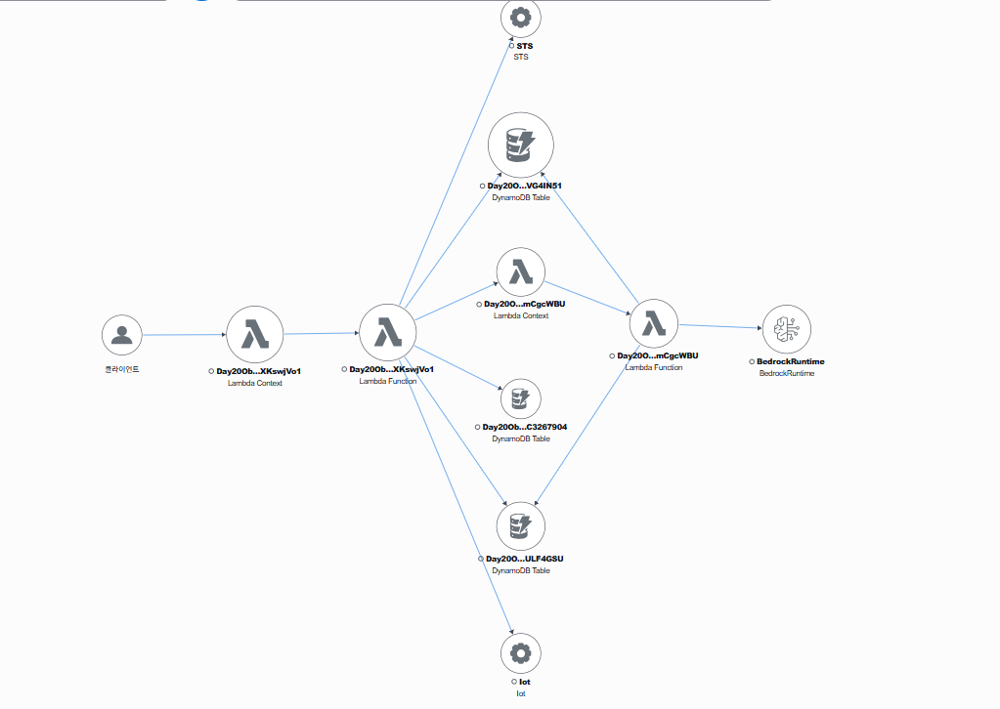
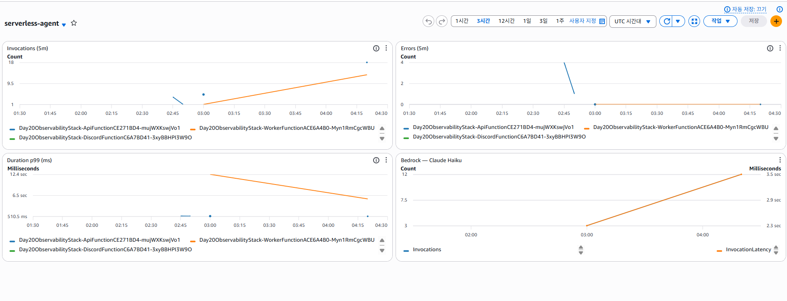
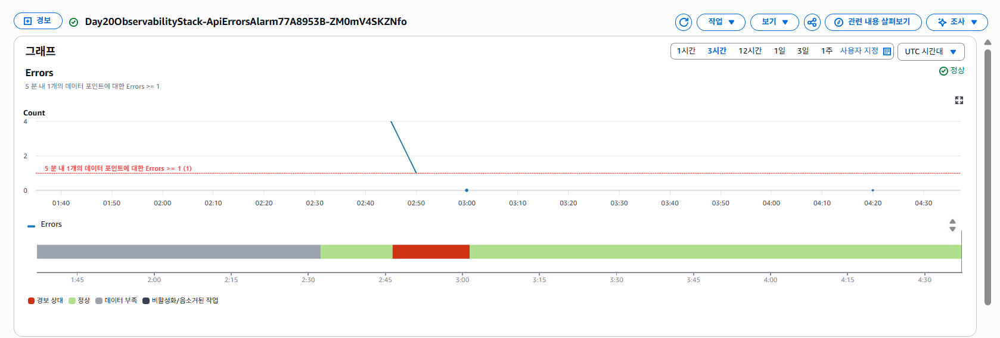
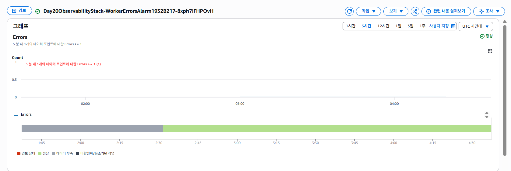

# Day 20: 관측성 — X-Ray 분산추적 + CloudWatch 대시보드/알람

Day 19 까지 "무엇을 만드느냐"였다면, Day 20 은 **"돌아가는 걸 어떻게 들여다보느냐"** 다. 지금까지 쌓은 API → Worker → Bedrock/DynamoDB/CostExplorer/IoT 흐름에 **X-Ray 분산추적**을 깔고, 세 람다의 호출·에러·지연을 **CloudWatch 대시보드** 한 화면에 모으고, 에러가 나면 **SNS 알람**으로 통보한다. 코드 로직은 한 줄도 안 바뀐다 — **계측만** 얹는다.

> **규칙: 매일 한 가지만 더하기.** Day 20 은 "관측성" 한 묶음. 비즈니스 로직(Agent Loop·skills·채널)은 Day 19 그대로. ※ "월 비용 예산"은 Day 17 `awsCost` 에서 비용을 다뤘으므로 여기선 제외하고 **운영 지표**에 집중.

## 🎯 이 day 가 답하는 것

1. **요청 하나가 어디서 시간을 쓰나** — X-Ray active tracing + AWS SDK 클라이언트 래핑으로, 한 trace 에서 **API → Worker → Bedrock(모델 지연) / DynamoDB / Cost Explorer** subsegment 가 보인다. "왜 느려?"를 추측 대신 **trace 로** 본다.
2. **전체가 건강한가** — CloudWatch 대시보드에 세 람다(API/Worker/Discord)의 **호출·에러·p99 지연** + Bedrock 호출/지연을 한 화면에.
3. **터지면 어떻게 아나** — Worker/API 에러가 5분 내 1건이라도 나면 **SNS 토픽 → 이메일** 통보(알아서 보고 있을 필요 없음).
4. **공짜 점심은 없다** — X-Ray·CloudWatch 도 비용이 있다(소액). 학습 규모에선 무시할 수준이지만, 켜고 끄는 스위치를 의식한다.

## 🧩 어떻게 계측했나

| 계층 | 방법 | 효과 |
|---|---|---|
| 함수 단위 추적 | `tracing: Tracing.ACTIVE` (api/worker/discord) | 각 람다가 trace 세그먼트로 잡힘. xray:Put* 권한 CDK 자동 |
| 호출 단위 추적 | `AWSXRay.captureAWSv3Client(client)` (worker: Bedrock/DDB/CE, api: DDB/Lambda) | downstream 호출이 subsegment 로 → 한 trace 로 연결 |
| 대시보드 | `cloudwatch.Dashboard` + `fn.metricInvocations/Errors/Duration` | 호출/에러/p99 + Bedrock |
| 알람 | `metric.createAlarm` + `SnsAction` | 에러 → SNS → 이메일 |

> **Lambda@Edge(`edgeFn`)는 X-Ray active tracing 미지원** → 의도적으로 제외했다(켜면 배포 실패).

## 🔌 코드 변화는 "클라이언트 한 줄 감싸기"뿐

```js
import AWSXRay from "aws-xray-sdk-core";
// 전:  const bedrock = new BedrockRuntimeClient({});
// 후:  ↓ 호출이 trace 의 subsegment 로 잡힌다(active tracing 컨텍스트 없으면 그냥 통과 — 로컬 안전)
const bedrock = AWSXRay.captureAWSv3Client(new BedrockRuntimeClient({}));
const ddb = DynamoDBDocumentClient.from(AWSXRay.captureAWSv3Client(new DynamoDBClient({})));
```

API 쪽은 특히 **`lambdaClient`(Worker invoke)를 감싸야** API → Worker 가 한 trace 로 이어진다.

## 🪜 Day 19 → Day 20 diff

| 측면 | Day 19 | Day 20 |
|---|---|---|
| 추적 | 없음 | **X-Ray**(api/worker/discord ACTIVE + SDK 래핑) |
| 지표 가시화 | CloudWatch 기본 메트릭 흩어짐 | **대시보드 1장**(호출/에러/p99 + Bedrock) |
| 장애 인지 | 로그 뒤져야 | **SNS 알람**(Worker/API 에러) |
| 의존성 | — | **aws-xray-sdk-core** 추가 |
| 코드 | — | 클라이언트 생성부만 래핑(로직 불변) |

**안 변한 것**: Agent Loop·skills(awsCost/calendar)·Discord·엣지/호스팅·테이블 전부 Day 19 그대로.

## 🚀 배포 + 검증 절차

### 1) 배포 (이전 day 들의 context 그대로 + 알림 이메일 옵션)

```powershell
cd day-20-observability
npm install
npm run deploy -- -c discordPublicKey=<hex> -c calendarIcsUrl=<iCloud .ics> -c alertEmail=<너@메일>
# Outputs: SiteUrl, DashboardUrl, XRayConsoleUrl, AlertTopicArn
```
> `alertEmail` 주면 **SNS 확인 메일**이 와요 → 링크 한 번 클릭해야 알람을 받습니다.

### 2) 트래픽 한 번 흘리기

```powershell
$SITE="<SiteUrl>"
$U  = curl.exe -s -X POST "$SITE/api/users" -H "content-type: application/json" -d '{\"name\":\"obs\"}' | ConvertFrom-Json
$S  = curl.exe -s -X POST "$SITE/api/users/$($U.id)/sessions" -H "content-type: application/json" -d '{\"title\":\"obs\"}' | ConvertFrom-Json
$enc=[System.Text.UTF8Encoding]::new($false); [System.IO.Directory]::SetCurrentDirectory((Get-Location).Path)
$p=@{userId=$U.id;sessionId=$S.sessionId;message="48571 곱하기 92834 계산해줘"}|ConvertTo-Json -Compress
[System.IO.File]::WriteAllBytes("payload.json",$enc.GetBytes($p))
curl.exe -s -X POST "$SITE/api/chat" -H "content-type: application/json" --data-binary "@payload.json"
```

### 3) 보기

- **X-Ray**: `XRayConsoleUrl` (CloudWatch → X-Ray traces / Trace Map) → **API → Worker → Bedrock** 노드가 그려지고, trace 하나 열면 Bedrock/DDB 호출 시간이 보인다.
- **대시보드**: `DashboardUrl` (CloudWatch → Dashboards → `serverless-agent`) → 방금 호출이 Invocations/Errors/Duration 에 찍힘.
- **알람 테스트(선택)**: 일부러 에러 유도(예: 잘못된 sessionId 로 worker 실패) 후 CloudWatch → Alarms 에서 `WorkerErrorsAlarm` 이 ALARM 으로 가는지 + 이메일 오는지.

> ⏱️ 지표/트레이스는 **1~3분 지연**해서 나타난다. 바로 안 보여도 잠시 기다리기.

#### 실제 화면

**X-Ray 서비스 맵** — `클라이언트 → API → Worker → Bedrock` + DynamoDB·STS·IoT 다운스트림까지 한 장에.



**CloudWatch 대시보드** (`serverless-agent`) — Invocations / Errors / p99 Duration / Bedrock 지표.



**알람 — 장애 라이프사이클** — 배포 직후 API 가 에러를 쏟자 `ApiErrorsAlarm` 이 임계(Errors≥1)를 넘어 **ALARM** 으로 전환됐다가, 수정 후 자동으로 **OK** 복귀. Worker 는 내내 정상.

<table>
  <tr>
    <td width="50%"></td>
    <td width="50%"></td>
  </tr>
</table>

### 4) 정리

```powershell
npx cdk destroy --force   # Lambda@Edge 복제본 지연(Day 16 함정 #46) — 시간 두고 재시도
```

## ⚠️ 함정 / 트러블슈팅 (Day 20 발견분)

| # | 함정 | 원인 | 회피 |
|---|---|---|---|
| 65 | Lambda@Edge 에 tracing 주면 배포 실패 | Lambda@Edge 는 X-Ray active tracing 미지원 | `edgeFn` 은 `Tracing.ACTIVE` **제외** |
| 66 | esbuild `Could not resolve 'aws-sdk'` | aws-xray-sdk-core 가 v2 capture 경로에서 `require('aws-sdk')` (미사용) | `externalModules` 에 **`aws-sdk`** 추가 |
| 67 | trace 에 함수만 뜨고 호출(Bedrock 등) 안 보임 | active tracing 만으론 subsegment 안 생김 | 클라이언트를 **`captureAWSv3Client`** 로 래핑(둘 다 필요) |
| 68 | API 와 Worker 가 **따로** 추적됨 | async invoke 가 trace 를 안 이음 | API 의 `lambdaClient` 를 X-Ray 로 래핑 → invoke 가 subsegment 로 |
| 69 | 알람이 계속 `INSUFFICIENT_DATA` | 트래픽 없을 때 에러 지표가 빈값 | `treatMissingData: NOT_BREACHING` |
| 70 | 알람 메일이 안 옴 | SNS 이메일 구독 미확인 | 확인 메일의 **Confirm** 링크 클릭 후에야 수신 |
| ⭐ 78 | **API(ESM 번들) 가 INIT 단계에서 크래시 → 전 요청 500** (`Dynamic require of "util" is not supported`) | `aws-xray-sdk-core`(→`cls-hooked`) 가 ESM 번들에서 동적 `require()` 호출 — esbuild ESM 출력엔 `require` 가 없어 **모듈 로드 시점에 폭발** | 번들 `banner` 로 `createRequire(import.meta.url)` 주입 → esbuild `__require` shim 이 전역 `require` 를 사용. (Worker 는 CJS 출력이라 무사) |

> 함정 1~58 Day 11~18, 59~64 Day 19, 65~70 Day 20, 71~77 Day 21. **⭐ 78 = Day 20 스택을 새 환경에 재배포하다 뒤늦게 발견(번호는 누적 순).**

> ⭐ **#78 상세** — Worker(CJS)는 X-Ray 래핑이 멀쩡한데 API만 죽었던 이유가 여기. esbuild 의 `__require` shim 은 *전역 `require` 가 있으면 그걸 쓰고, 없으면 throw* 한다. 그래서 `banner` 로 `import { createRequire } from "module"; const require = createRequire(import.meta.url);` 한 줄을 ESM 번들 최상단에 주입하면 동적 require 가 살아난다. ESM 유지 + CJS 전환 불필요.

## 🧠 남긴 숙제 → 다음 day 들로

| 숙제 | 어디서 |
|---|---|
| CI/CD — GitHub Actions OIDC 로 `cdk deploy` 자동화(무키 배포) | Day 21 |
| 캡스톤 회고 — 전체 아키텍처 종합 다이어그램 + 트러블슈팅 #1~70 요약 + 비용/보안 | Day 22 |
| 구조화 로깅(JSON) + 로그 기반 메트릭/알람 | 옵션 |

## 🎁 Day 20 이 남긴 자산

- **분산추적 한 장** — "왜 느려/왜 터져"를 trace 로 보는 습관(추측 금지)
- **계측은 로직과 분리** — 클라이언트 래핑 + CDK 위젯만으로 관측성 확보, 비즈니스 코드 불변
- **알람 파이프라인** — 지표 → 알람 → SNS, 운영의 기본기(DevOps 시그널)
