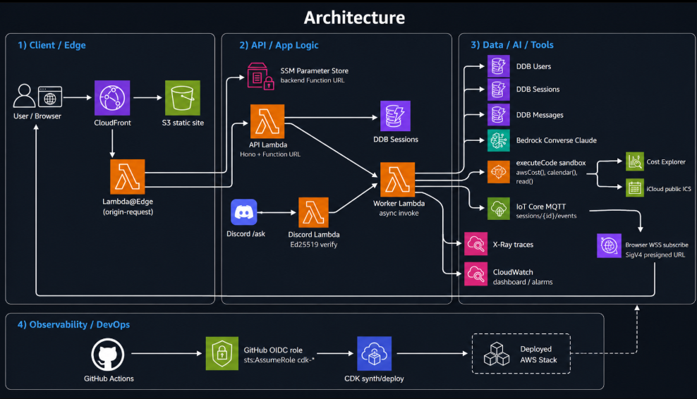

# Day 22: Capstone — Serverless Agent 프로젝트 마침표

22일 동안 원본 [`breath103/serverless-agent`](https://github.com/breath103/serverless-agent) 를 한 번에 복제하지 않고, AWS 서버리스 에이전트의 부품을 **작게 만들고 → 연결하고 → 원본의 고급 패턴을 차용하고 → 내 확장으로 갈라지는** 방식으로 쌓았다.

Day 22 는 새 리소스를 더 만들지 않는다. 대신 지금까지 만든 시스템을 하나의 아키텍처로 다시 접고, 원본과의 차이, 누적 트러블슈팅, 비용/보안 운영 기준을 정리한다.

## 최종 결론

- **원본의 핵심 뼈대는 재현했다**: CloudFront/S3 프론트, Lambda@Edge origin rewrite, Function URL API, API/Worker Lambda 분리, DynamoDB 영속화, Bedrock Agent Loop, IoT MQTT 실시간 이벤트.
- **일부는 학습용으로 단순화했다**: 원본의 인증/프로필/메모리/Google OAuth/Tavily/Telegram 전체 제품 구조 대신, `userId` 기반 API와 하루 단위 CDK 프로젝트로 핵심 흐름을 분해했다.
- **일부는 의도적으로 다르게 갔다**: 원본 Telegram/Google Calendar/OAuth skill 대신 Discord bot, iCloud 공개 ICS calendar skill, `awsCost` skill, X-Ray/CloudWatch 운영 계측, GitHub OIDC 배포를 추가했다.
- **최종 산출물은 제품형 단일 앱보다 "서버리스 에이전트 설계 노트북"에 가깝다**: 각 day 폴더는 독립 실험이고, Day 22 는 그 실험들을 한 장의 지도에 묶는다.

## 원본 레포 확인 메모

2026-06-16 기준 원본 `breath103/serverless-agent` 의 `main` 최신 커밋은 `fa5f622` 였다. 원본 README 의 실제 구성은 다음과 같았다.

| 원본 구성 | 역할 | 이 레포에서 대응한 day |
|---|---|---|
| `packages/backend` | Hono API Lambda, Worker Lambda, agent runtime, auth, repos, skills | Day 5~7, 11~14, 17~20 |
| `packages/frontend` | Vite/React UI, realtime client, settings/skills UI | Day 8~9, 15~16 |
| `packages/edge` | CloudFront + Lambda@Edge + SSM 기반 origin rewrite | Day 9, Day 16 |
| `packages/shared` | SSM/config/env 공통 유틸 | Day 16 에 SSM 패턴 차용 |
| DynamoDB 7개 테이블 | users/sessions/profiles/memories/chat-sessions/chat-messages/user-skills | Day 12 에 3개 테이블로 핵심 축소 |
| IoT Core WSS MQTT | 브라우저 실시간 tool-call/event 표시 | Day 14~15 |
| Skill runtimes | memory, web-search, google-calendar | Day 17 `awsCost`, Day 19 `calendar` 로 변형 |
| Telegram channel | 외부 채널 미러링 | Day 18 Discord Interactions 로 변형 |

핵심 차이는 **원본은 완성형 앱**, 이 레포는 **학습 가능한 증분 구현**이라는 점이다. 원본은 제품 수준의 인증, 세션, OAuth skill 저장, 프론트 라우팅, 디자인 시스템까지 포함한다. 이 레포는 그중 에이전트가 움직이는 필수 데이터패스를 먼저 증명하고, 매일 하나의 함정만 깊게 파는 쪽을 택했다.

## 최종 아키텍처

### 요청 라이프사이클

1. 브라우저는 CloudFront 의 같은 origin 으로 정적 파일과 `/api/*` 를 모두 호출한다.
2. Lambda@Edge 는 `/api/*` 요청만 가로채 SSM 에 저장된 backend Function URL 로 origin 을 바꾼다.
3. API Lambda 는 유저/세션/메시지를 DynamoDB 에 기록하고 Worker Lambda 를 비동기로 호출한 뒤 즉시 반환한다.
4. Worker 는 최근 메시지를 읽어 Bedrock Converse 루프를 돌리고, 모델이 `executeCode` 를 요청하면 샌드박스에서 코드를 실행한다.
5. 샌드박스에는 `awsCost()` 와 `calendar()` 같은 skill 이 주입되어 외부 조회를 수행한다. 모델에는 `read()` 결과만 되먹이고, skill 호출 메타데이터는 저장/MQTT 이벤트로만 남긴다.
6. Worker 는 단계별 이벤트를 DynamoDB 에 저장하고 IoT Core MQTT 로 publish 한다.
7. 브라우저는 세션 한정 SigV4 WSS URL 로 토픽을 구독해 tool-call 진행 상황을 실시간으로 렌더한다.
8. 운영자는 X-Ray trace, CloudWatch dashboard/alarm, GitHub Actions OIDC 배포 흐름으로 문제를 추적하고 배포한다.

## 22일 로드맵 회고

| 구간 | day | 얻은 것 |
|---|---:|---|
| Phase 1: 부품 | 1~4 | AWS 계정/CLI, Bedrock 호출, Lambda CDK 배포, DynamoDB CRUD |
| Phase 2: MVP | 5~10 | 채팅 API, Function URL streaming, Hono 라우팅, React/S3/CloudFront, Phase 2 비용/함정 정리 |
| Phase 3: 원본 패턴 | 11~16 | API/Worker 분리, 멀티 테이블, Agent Loop, IoT MQTT, 브라우저 WSS, Lambda@Edge+SSM |
| Phase 4: 내 확장 | 17~21 | Cost Explorer skill, Discord bot, iCloud calendar skill, X-Ray/CloudWatch, GitHub OIDC CI/CD |
| Capstone | 22 | 전체 아키텍처, 원본 대비, 트러블슈팅, 비용/보안 운영 기준 정리 |

### 가장 큰 설계 전환점

- **Day 6**: API Gateway 대신 Function URL + response streaming 으로 원본 노선에 맞춤.
- **Day 11**: HTTP 요청 시간과 LLM 실행 시간을 분리했다. 여기서 "채팅 API" 가 "에이전트 작업 큐" 로 바뀌었다.
- **Day 12**: 단일 테이블에서 Users/Sessions/Messages 로 나누며 원본의 저장 모델에 가까워졌다.
- **Day 13**: 텍스트 생성기가 아니라 도구를 실행하는 Agent Loop 가 됐다.
- **Day 14~15**: polling/streaming 대신 MQTT push 로 브라우저 실시간성을 확보했다.
- **Day 16**: CDN 과 backend 를 SSM 으로 디커플링하면서 원본의 edge 패턴을 재현했다.
- **Day 17~19**: 원본 skill 구조를 따라가되, 비용/캘린더/Discord 라는 내 사용처로 갈라졌다.
- **Day 20~21**: "된다"에서 "운영할 수 있다"로 넘어갔다. 관측성과 키리스 배포가 붙었다.

## 트러블슈팅 #1~77 요약

| 범위 | 주제 | 핵심 교훈 |
|---|---|---|
| #1~4 | DynamoDB/Bedrock 기본 | `Scan` 대신 키 기반 `Query`, Bedrock 권한 ARN 구체화, SK 충돌 방지, 첫 메시지 user 보장 |
| #5~8 | Function URL streaming | `RESPONSE_STREAM`, stream 전용 IAM, `responseStream.end()`, Function URL CORS 차이 |
| #9~12 | S3/Vite/CloudFront | 신형 S3 public block 정책, Vite build-time env, Function URL Host 헤더, `/api` strip 한계 |
| #13~16 | API/Worker 분리 | async invoke 명시, 빈 세션 가드, alias 단위 invoke grant, API 에서 Bedrock 권한 제거 |
| #17~20 | 멀티 테이블 | 세션 조회엔 `userId` 필요, session bump 는 best-effort, 커서 키 이름 통일, 테이블별 최소권한 |
| #21~26 | Agent Loop | `toolUse`/`toolResult` 짝 유지, 연속 role 병합, `read()` 강제, undefined 제거, step/timeout 컷 |
| #27~31 | IoT publish | Data-ATS endpoint 조회, `topic`/`topicfilter` ARN 차이, IoT control/data SDK 분리, best-effort publish |
| #32~38 | 브라우저 MQTT | IoT SigV4 token 처리, `iotdevicegateway`, STS 세션정책, CDK 순환 의존, MQTT 3.1.1, 구독 순서 |
| #39~46 | Lambda@Edge | env var 미지원, Windows esbuild define 함정, token URL 파싱, us-east-1 고정, Host 재작성, SSM 권한, destroy 지연 |
| #47~52 | Cost skill | Cost Explorer 활성화/리전, sandbox timeout, LLM 에 숨길 메타데이터 분리, CE 호출 비용, End date exclusive |
| #53~58 | Discord | raw body Ed25519 검증, SPKI DER 래핑, 3초 제한과 deferred response, followup PATCH URL, global command 전파 지연 |
| #59~64 | Calendar skill | ICS context 누락, iCloud 공개 링크 제한, timezone, recurrence expansion, fetch/file/timeout 제한, 공개 캘린더 선택 |
| #65~70 | Observability | Lambda@Edge X-Ray 미지원, `aws-sdk` external, AWS SDK v3 client wrapping, async invoke trace 연결, alarm missing data, SNS 구독 확인 |
| #71~77 | CI/CD OIDC | OIDC provider 중복, trust 범위, 배포 역할 순환, 과권한 방지, bootstrap 선행, 워크플로 위치, `id-token: write` |

## 비용 정리

| 영역 | 비용 감각 | 운영 기준 |
|---|---|---|
| Lambda / DDB | 학습 트래픽은 대체로 무료 티어 안쪽 | 배포 검증 후 `cdk destroy` 로 누수 차단 |
| Bedrock | 실제 토큰 비용 발생 | `HISTORY_LIMIT`, Agent step limit, 짧은 검증 프롬프트 사용 |
| CloudFront / Lambda@Edge | 소액이지만 전파/삭제 지연이 있음 | 불필요한 재배포 줄이고, destroy 실패 시 시간 두고 재시도 |
| IoT Core MQTT | 메시지/연결 수가 늘면 과금 | 세션별 토픽 한정, 필요 시 연결 TTL/구독 정리 |
| Cost Explorer | API 호출당 비용 발생 가능 | `awsCost` 는 필요할 때만 호출, 질문당 1~2회로 제한 |
| CloudWatch / X-Ray | 계측 데이터 수집 비용 발생 | 운영 day 에서만 켜는 리소스를 의식, 알람 missing data 는 non-breaching |
| GitHub Actions | public repo 기준 대체로 부담 작음 | push/PR 은 synth 만, deploy 는 수동 dispatch |

## 보안 정리

| 영역 | 적용한 기준 |
|---|---|
| AWS 권한 | API/Worker/Discord/Edge 역할을 분리하고, 각 역할이 쓰는 테이블/서비스만 허용 |
| Bedrock | API 가 아니라 Worker 에만 Bedrock 권한 부여 |
| DynamoDB | Users/Sessions/Messages 를 나눠 접근 책임을 분리 |
| 브라우저 MQTT | Lambda 자격증명을 직접 넘기지 않고 STS AssumeRole + 세션정책 + 1시간 URL |
| Discord | raw body + timestamp + Ed25519 서명검증, bot token 없이 followup webhook 사용 |
| Calendar | 공개 ICS 읽기 전용, Apple 인증/비밀 저장 없음 |
| Cost skill | Cost Explorer read-only, skill 호출 내역은 LLM 입력과 운영 메타데이터를 분리 |
| Edge | backend URL 은 SSM 에 저장, CloudFront 뒤 same-origin `/api` 로 노출 |
| CI/CD | GitHub OIDC 로 저장된 AWS 장기 키 0개, trust 는 이 레포로 한정, deploy 는 수동 |

## 남은 선택지

이 프로젝트는 Day 22 로 "학습 로드맵"은 닫혔지만, 제품으로 키우려면 원본 쪽 기능을 다시 가져오면 된다.

| 다음 선택지 | 가져올 원본 패턴 |
|---|---|
| 로그인/세션 고도화 | scrypt password, HTTP-only cookie, session TTL |
| 메모리 기능 | profiles/memories 테이블 + memory skill |
| 웹 검색 | Tavily `web-search` skill |
| OAuth 캘린더 | Google Calendar OAuth + user-skills 저장 |
| 프론트 제품화 | TanStack Router 기반 dashboard/settings/chats/memories UI |
| 배포 자동화 강화 | PR `cdk diff` 코멘트, main merge 승인 게이트 |

## 마침표

원본을 따라가며 가장 크게 배운 건 "서버리스 에이전트"가 단일 Lambda 하나가 아니라는 점이다. 진짜 구조는 **시간을 분리하는 Worker**, **상태를 남기는 DynamoDB**, **진행을 밀어주는 MQTT**, **경계를 정리하는 Edge**, **도구를 안전하게 호출하는 sandbox**, **운영자가 볼 수 있는 trace/alarms**, **키를 남기지 않는 배포**가 서로 맞물릴 때 나온다.
